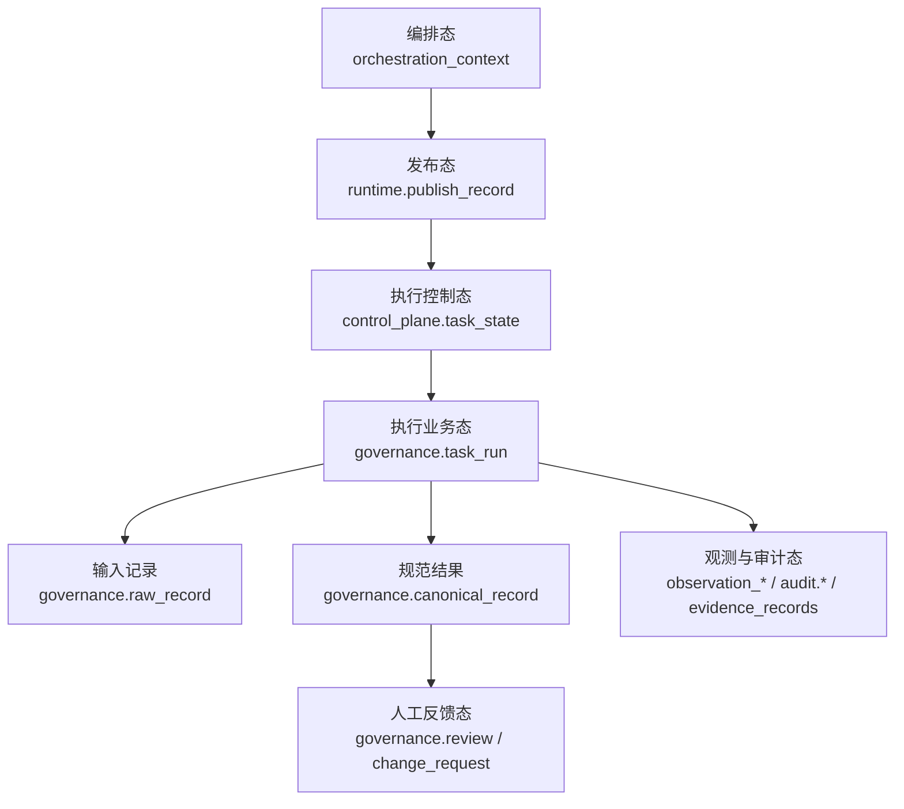

# 数据模型总览

> 文档状态：当前有效
> 角色：系统正式数据模型入口
> 适用范围：工作包发布、任务执行、治理结果、人工审核、反馈闭环
> 关联文档：
> - `docs/04_系统组件设计/04_数据与人工介入/数据存储体系设计.md`
> - `docs/04_系统组件设计/03_Runtime执行/Runtime调度与任务系统.md`
> - `docs/04_系统组件设计/01_工厂Agent编排/编排记忆与恢复设计.md`
> - `docs/05_数据模型设计/数据库分域设计.md`
> - `docs/05_数据模型设计/数据库跨界约束.md`
> - `docs/05_数据模型设计/可信数据数据库契约设计.md`
> - `docs/05_数据模型设计/核心表结构设计.md`

## 1. 这份文档回答什么

这份文档不再讨论“表放在哪个 schema”，而是回答三个更贴近工程的问题：

1. 系统里到底有哪些核心数据对象。
2. 这些对象之间如何关联。
3. 页面、API、审核、验收应该从哪一层读取。

## 2. 数据模型全景图

图说明：这张图按“编排态 -> 发布态 -> 执行态 -> 业务态 -> 人工反馈态”展开，帮助快速区分不同模型层。

## 3. 核心模型分组

| 模型组 | 核心对象 | 作用 | 继续阅读 |
|---|---|---|---|
| 数据库结构模型 | `governance / runtime / control_plane / trust_meta / trust_data / audit` | 定义数据库分域、禁止跨界边界和核心表结构 | [数据库分域设计](数据库分域设计.md)、[数据库跨界约束](数据库跨界约束.md)、[核心表结构设计](核心表结构设计.md) |
| 可信数据模型 | `source_registry`、`source_snapshot`、`active_release`、`capability_registry`、`trust_data.*` | 定义可信来源、标准查询数据和过渡口径 | [可信数据数据库契约设计](可信数据数据库契约设计.md) |
| 编排模型 | `boot_context`、`discovery_facts`、`interaction_state`、`blocker_ticket` | 支撑 Factory Agent 的暂停、恢复、人工接管 | `编排记忆与恢复设计` |
| 工作包与任务模型 | `publish_record`、`task_state`、`task_run` | 把“工作包版本”和“执行实例”连接起来 | [工单与任务模型](工单与任务模型.md) |
| 数据处理阶段模型 | `batch`、`raw_record`、`canonical_record`、`observation_*` | 描述治理处理各阶段的输入、输出、指标 | [数据处理阶段模型](数据处理阶段模型.md) |
| 审核与反馈模型 | `review`、`change_request`、`publish_decision`、`gate_state` | 承接人工审核、规则变更、门禁确认 | [审核与反馈模型](审核与反馈模型.md) |

## 4. 三条最重要的主链路

### 4.1 工作包发布链路

1. `workpackage_id@version`
2. `runtime.publish_record`
3. `control_plane.task_state`
4. `control_plane.evidence_records`

### 4.2 数据治理处理链路

1. `governance.batch`
2. `governance.raw_record`
3. `governance.task_run`
4. `governance.canonical_record`
5. `governance.review`

### 4.3 人机协同恢复链路

1. `interaction_state`
2. `blocker_ticket`
3. `gate_state`
4. `publish_decision`
5. `timeline`

## 5. 建模原则

1. 不把“工作包版本”和“执行实例”混成一个对象。
2. 不把“治理业务结果”和“控制面状态”混在一张表里。
3. 不把“人工审核结果”和“执行证据”混成一类字段。
4. 需要恢复的状态必须落为结构化对象，不能只存在日志文本里。

## 6. 阅读顺序建议

1. 先看 [数据库分域设计](数据库分域设计.md)
2. 再看 [数据库跨界约束](数据库跨界约束.md)
3. 再看 [核心表结构设计](核心表结构设计.md)
4. 再看 [可信数据数据库契约设计](可信数据数据库契约设计.md)
5. 然后看 [工单与任务模型](工单与任务模型.md)
6. 再看 [数据处理阶段模型](数据处理阶段模型.md)
7. 最后看 [审核与反馈模型](审核与反馈模型.md)
