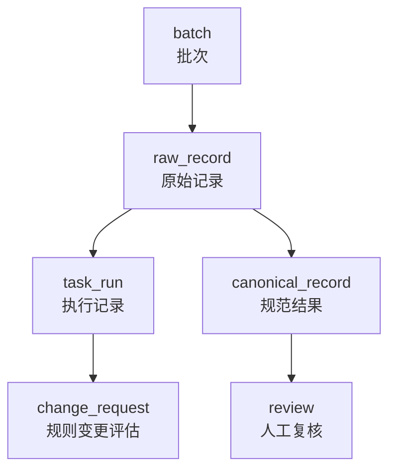
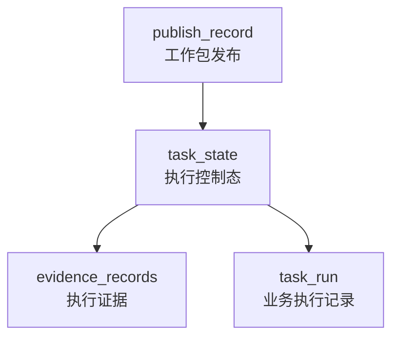
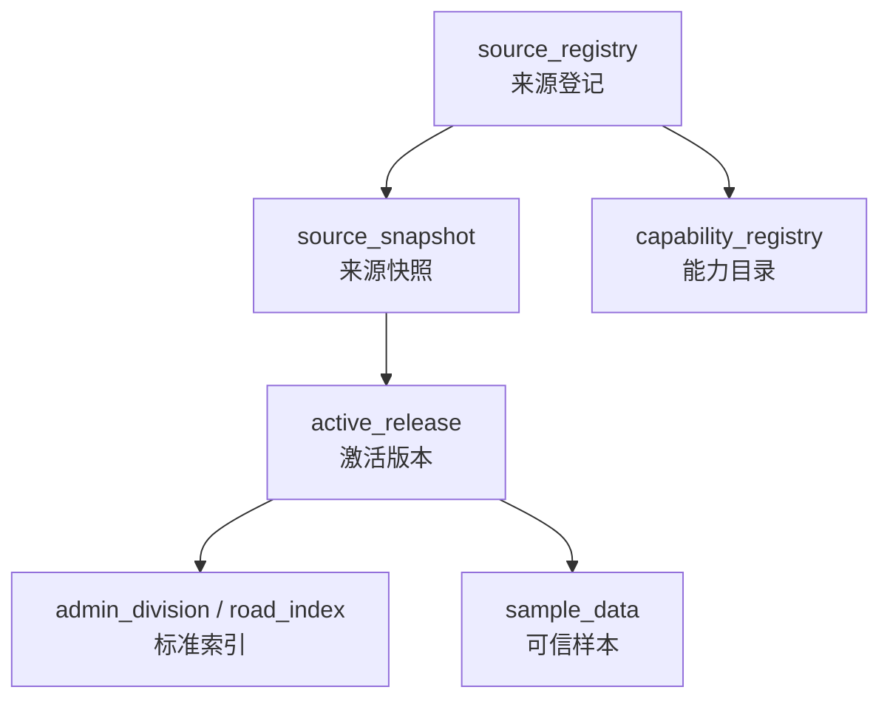

# 核心表结构设计

> 文档状态：当前有效
> 角色：系统正式核心表结构设计说明
> 适用范围：治理业务主表、发布与控制主表、可信数据主表、审计与观测辅助表
> 关联文档：
> - `docs/05_数据模型设计/数据库分域设计.md`
> - `docs/04_系统组件设计/04_数据与人工介入/数据存储体系设计.md`
> - `docs/04_系统组件设计/03_Runtime执行/Runtime调度与任务系统.md`

## 1. 这份文档怎么读

这份文档不试图列出数据库里的每一个索引和每一个历史兼容列，而是聚焦三类问题：

1. 主链路到底依赖哪些核心表。
2. 这些表的主键、引用关系和字段分组是什么。
3. 不同角色一旦把哪些表当开放共享入口，就会发生跨界。

## 2. 治理业务主链表关系

图说明：这张图只看治理业务主链，不把 Runtime 控制态和可信数据域混进来。

## 3. 发布与控制主链表关系

图说明：这张图强调“版本态、实例态、证据态”三种对象分层。

## 4. 可信数据与能力主链表关系

图说明：这张图只看可信来源和标准查询数据的主链，不展开治理结果回写。

## 5. 治理业务域核心表

### 5.1 `governance.batch`

作用：记录一次治理批次的主信息。

| 设计项 | 说明 |
|---|---|
| 主键 | `batch_id` |
| 主要引用 | 被 `raw_record.batch_id`、`task_run.batch_id` 逻辑关联 |
| 主要写入方 | 导入链路、治理任务创建流程 |
| 主要读取方 | 批次页、任务页、统计报表 |

| 字段组 | 核心字段 | 设计说明 |
|---|---|---|
| 标识 | `batch_id` | 批次唯一标识 |
| 业务属性 | `batch_name`、`source`、`status` | 标识批次来源和处理状态 |
| 时间戳 | `created_at`、`updated_at` | 支撑列表排序和状态更新时间展示 |

### 5.2 `governance.task_run`

作用：记录一次治理执行实例的业务结果状态。

| 设计项 | 说明 |
|---|---|
| 主键 | `task_id` |
| 主要引用 | 逻辑关联 `batch_id`、`trace_id`、`agent_run_id` |
| 主要写入方 | Worker / Bundle |
| 主要读取方 | 任务详情页、结果回放、异常排查 |

| 字段组 | 核心字段 | 设计说明 |
|---|---|---|
| 标识 | `task_id` | 一次执行实例唯一标识 |
| 归属 | `batch_id` | 归属哪个输入批次 |
| 状态 | `status`、`retry_count` | 体现执行进度与重试情况 |
| 异常 | `error_code`、`error_message` | 体现业务执行失败原因 |
| 追踪 | `trace_id`、`agent_run_id`、`runtime` | 串联观测、Agent 与 Runtime |
| 时间戳 | `created_at`、`updated_at`、`finished_at` | 支撑生命周期查询 |

### 5.3 `governance.raw_record`

作用：承接治理输入的原始记录。

| 设计项 | 说明 |
|---|---|
| 主键 | `raw_id` |
| 主要引用 | 归属 `batch_id`，被 `canonical_record.raw_id`、`review.raw_id` 关联 |
| 主要写入方 | 批量导入、文件上传、数据接入脚本 |
| 主要读取方 | 原始数据复核、回放、差异对比 |

| 字段组 | 核心字段 | 设计说明 |
|---|---|---|
| 标识 | `raw_id`、`batch_id` | 唯一记录和所属批次 |
| 原文 | `raw_text` | 原始地址文本真相源 |
| 结构化拆分 | `province`、`city`、`district`、`street`、`detail` | 输入预拆分字段 |
| 指纹 | `raw_hash` | 去重和对比依据 |
| 时间戳 | `ingested_at` | 记录导入时间 |

### 5.4 `governance.canonical_record`

作用：承接地址标准化后的正式结果。

| 设计项 | 说明 |
|---|---|
| 主键 | `canonical_id` |
| 主要引用 | 关联 `raw_id`，携带 `ruleset_version`、`trace_id` |
| 主要写入方 | Worker / Bundle |
| 主要读取方 | 结果页、人工审核页、报表、对外结果 API |

| 字段组 | 核心字段 | 设计说明 |
|---|---|---|
| 标识 | `canonical_id`、`raw_id` | 结果主键与原始记录引用 |
| 标准结果 | `canon_text` | 规范化后的地址文本 |
| 地址部件 | `province`、`city`、`district`、`street`、`road`、`house_no`、`building`、`unit_no`、`room_no` | 支撑结构化展示和下游对接 |
| 质量 | `confidence`、`strategy` | 说明结果可信度和生成策略 |
| 证据 | `evidence` | 保存规则命中、候选来源、校验摘要 |
| 追踪 | `ruleset_version`、`trace_id`、`agent_run_id` | 串联规则、观测和 Agent |
| 时间戳 | `created_at`、`updated_at` | 结果更新时间 |

### 5.5 `governance.review`

作用：承接人工复核后的最终结果。

| 设计项 | 说明 |
|---|---|
| 主键 | `review_id` |
| 主要引用 | 关联 `raw_id`，与 `canonical_record` 形成“机器结果 + 人工结论”组合 |
| 主要写入方 | 人工审核流程 |
| 主要读取方 | 审核页面、质检、反馈回流 |

| 字段组 | 核心字段 | 设计说明 |
|---|---|---|
| 标识 | `review_id`、`raw_id` | 唯一审核记录与被审核原始记录 |
| 审核结论 | `review_status`、`final_canon_text` | 人工最终判定 |
| 审核信息 | `reviewer`、`comment` | 审核人和说明 |
| 时间戳 | `reviewed_at`、`created_at`、`updated_at` | 审核过程时间线 |

### 5.6 `governance.change_request`

作用：承接规则集候选结果与基线结果的变更审批。

| 设计项 | 说明 |
|---|---|
| 主键 | `change_id` |
| 主要引用 | `from_ruleset_id`、`to_ruleset_id`、`baseline_task_id`、`candidate_task_id` |
| 主要写入方 | 规则评估流程、人工审批流程 |
| 主要读取方 | 规则对比、变更审批、回归评审 |

| 字段组 | 核心字段 | 设计说明 |
|---|---|---|
| 标识 | `change_id` | 变更单唯一标识 |
| 规则版本 | `from_ruleset_id`、`to_ruleset_id` | 描述基线和候选规则集 |
| 对比对象 | `baseline_task_id`、`candidate_task_id` | 描述参与比较的两次运行 |
| 对比内容 | `diff_json`、`scorecard_json`、`evidence_bullets` | 差异、评分、证据摘要 |
| 审批状态 | `recommendation`、`status`、`approved_by`、`approved_at` | 记录推荐和最终审批 |
| 审核说明 | `review_comment` | 审批备注 |
| 时间戳 | `created_at`、`updated_at` | 变更生命周期 |

## 6. 发布与控制域核心表

### 6.1 `runtime.publish_record`

作用：记录工作包版本发布事实。

| 设计项 | 说明 |
|---|---|
| 主键 | `publish_id` |
| 唯一约束 | `workpackage_id + version` |
| 主要写入方 | Factory Agent / 发布门禁 |
| 主要读取方 | Runtime、发布查询页、验收流程 |

| 字段组 | 核心字段 | 设计说明 |
|---|---|---|
| 标识 | `publish_id`、`workpackage_id`、`version` | 发布记录及版本标识 |
| 发布状态 | `status` | 发布是否成功进入 Runtime |
| 证据与工件 | `evidence_ref`、`bundle_path` | 指向证据和 bundle 路径 |
| 确认信息 | `published_by`、`confirmation_user`、`confirmation_decision`、`confirmation_timestamp` | 发布确认闭环 |
| 时间戳 | `published_at`、`created_at`、`updated_at` | 发布时间线 |

### 6.2 `control_plane.task_state`

作用：记录 Runtime 任务执行控制态。

| 设计项 | 说明 |
|---|---|
| 主键 | `task_id` |
| 主要写入方 | Runtime Orchestrator |
| 主要读取方 | Runtime API、任务查询页、排障工具 |

| 字段组 | 核心字段 | 设计说明 |
|---|---|---|
| 标识 | `task_id` | 执行实例唯一标识 |
| 状态 | `state` | 当前执行状态 |
| 载荷 | `payload_json` | 状态附带上下文，例如 `workpackage_id@version`、审批信息、错误摘要 |
| 时间戳 | `updated_at` | 最近一次状态推进时间 |

### 6.3 `control_plane.evidence_records`

作用：记录 Runtime 状态转移和执行证据。

| 设计项 | 说明 |
|---|---|
| 主键 | `id` |
| 主要关联 | `task_id` |
| 主要写入方 | Runtime Orchestrator、Worker |
| 主要读取方 | 排障、回放、验收、审计工具 |

| 字段组 | 核心字段 | 设计说明 |
|---|---|---|
| 标识 | `id`、`task_id` | 证据记录主键与所属任务 |
| 时间 | `ts` | 证据发生时间 |
| 责任方 | `actor`、`action` | 谁执行了什么动作 |
| 工件 | `artifact_ref` | 关联的日志、文件、报告、bundle 等 |
| 结果 | `result` | 成功、失败或阶段性结论 |
| 补充上下文 | `metadata_json` | 保存结构化附加信息 |

## 7. 可信数据域核心表

### 7.1 `trust_meta.source_registry`

作用：登记可信来源的元信息。

| 设计项 | 说明 |
|---|---|
| 主键 | `namespace_id + source_id` |
| 主要写入方 | Trust Data Hub / 来源配置流程 |
| 主要读取方 | Trust Hub、Factory Agent |

| 字段组 | 核心字段 | 设计说明 |
|---|---|---|
| 标识 | `namespace_id`、`source_id`、`name` | 来源归属和名称 |
| 来源属性 | `category`、`trust_level`、`license` | 来源分类、可信等级和许可 |
| 接入方式 | `entrypoint`、`update_frequency`、`fetch_method` | 采集入口和更新策略 |
| 解析与校验 | `parser_profile`、`validator_profile` | 解析器和校验器配置 |
| 访问控制 | `enabled`、`allowed_use_notes`、`access_mode`、`robots_tos_flags` | 使用限制与开关 |
| 时间戳 | `created_at`、`updated_at` | 配置更新时间 |

### 7.2 `trust_meta.source_snapshot`

作用：记录某个来源的快照版本。

| 设计项 | 说明 |
|---|---|
| 主键 | `namespace_id + snapshot_id` |
| 主要关联 | 关联 `source_id`，被 `active_release`、`snapshot_quality_report`、`validation_replay_run` 引用 |
| 主要写入方 | Trust Data Hub 导入链路 |
| 主要读取方 | 能力盘点、可信数据发布、回放 |

| 字段组 | 核心字段 | 设计说明 |
|---|---|---|
| 标识 | `namespace_id`、`snapshot_id`、`source_id` | 快照归属与来源 |
| 版本信息 | `version_tag`、`status` | 快照版本和状态 |
| 采集信息 | `fetched_at`、`etag`、`last_modified`、`content_hash` | 外部来源版本依据 |
| 存储位置 | `raw_uri`、`parsed_uri` | 原始与解析后存储位置 |
| 数据内容 | `parsed_payload`、`row_count` | 解析摘要与行数 |

### 7.3 `trust_meta.capability_registry`

作用：登记 Agent 与工作包生成可用的外部能力目录。

| 设计项 | 说明 |
|---|---|
| 主键 | `capability_id` |
| 唯一约束 | `source_id + endpoint` |
| 主要写入方 | Trust Hub |
| 主要读取方 | Factory Agent、工作包生成器 |

| 字段组 | 核心字段 | 设计说明 |
|---|---|---|
| 标识 | `capability_id`、`source_id` | 能力标识和来源归属 |
| 提供方 | `provider`、`endpoint`、`tool_type` | 提供商、接口地址、工具类型 |
| 状态 | `status` | 能力可用性 |
| 时间戳 | `updated_at` | 最近同步时间 |

### 7.4 `trust_meta.active_release`

作用：标记某个来源当前激活的快照版本。

| 设计项 | 说明 |
|---|---|
| 主键 | `namespace_id` 或 `namespace_id + source_id` 的兼容口径 |
| 主要关联 | `active_snapshot_id` |
| 主要写入方 | Trust Data Hub 发布流程 |
| 主要读取方 | 标准查询服务、治理执行链路 |

| 字段组 | 核心字段 | 设计说明 |
|---|---|---|
| 标识 | `namespace_id`、`source_id` | 说明哪个命名空间、哪个来源当前被激活 |
| 激活版本 | `active_snapshot_id` | 指向当前正式快照 |
| 发布信息 | `activated_by`、`activated_at`、`activation_note` | 激活人、激活时间和备注 |

### 7.5 `trust_data.admin_division`

作用：提供行政区划标准索引。

| 设计项 | 说明 |
|---|---|
| 当前正式入口 | `trust_data.admin_division` |
| 物理现实 | 兼容视图与 bootstrap 物理表并存 |
| 主要写入方 | Trust Data Hub 导入链路 |
| 主要读取方 | 地址治理执行链路、标准查询 API |

| 字段组 | 核心字段 | 设计说明 |
|---|---|---|
| 命名空间与来源 | `namespace_id`、`source_id`、`snapshot_id` | 表示数据归属和版本 |
| 行政标识 | `division_id`、`adcode` | 当前存在两套兼容标识口径 |
| 名称层级 | `name`、`level` | 行政区名称和层级 |
| 父子关系 | `parent_id`、`parent_adcode` | 当前存在两套兼容父级字段 |
| 辅助字段 | `name_aliases`、`valid_from`、`valid_to` | 兼容别名和有效期口径 |

设计约束：

1. 新查询优先依赖 `division_id / parent_id` 与 `adcode / parent_adcode` 的兼容读取逻辑。
2. 新文档不得再把 `trust_db.admin_division` 记为正式查询入口。

### 7.6 `trust_data.sample_data`

作用：保存可信样本数据，支撑能力验证和示例查询。

| 设计项 | 说明 |
|---|---|
| 主键 | `sample_id` |
| 主要写入方 | Trust Hub |
| 主要读取方 | Agent、开发调试、能力验证 |

| 字段组 | 核心字段 | 设计说明 |
|---|---|---|
| 标识 | `sample_id`、`source_id` | 样本主键和来源归属 |
| 质量 | `trust_score` | 样本可信度 |
| 数据内容 | `content_json` | 样本内容 JSON |
| 时间戳 | `collected_at` | 采集时间 |

## 8. 审计与观测辅助表

这部分表对主链路很重要，但不需要全部展开成长篇字段说明。当前建议按下面口径理解：

| 表 | 角色 | 关键字段组 |
|---|---|---|
| `governance.ruleset` | 规则集主表 | `ruleset_id`、`version`、`config_json`、`is_active` |
| `governance.observation_event` | 观测事件 | `event_id`、`trace_id`、`event_type`、`status`、`payload_json` |
| `governance.observation_metric` | 观测指标 | `metric_id`、`metric_name`、`metric_value`、`labels_json` |
| `governance.alert_event` | 告警事件 | `alert_id`、`alert_rule`、`severity`、`status`、`trace_id` |
| `audit.event_log` | 审计事件 | `event_id`、`event_type`、`caller`、`payload` |
| `audit.api_audit_log` | API 审计日志 | API 调用主信息、请求响应摘要、时间戳 |

## 9. 当前表结构设计约束

1. `publish_record` 表示版本态，`task_state / task_run` 表示实例态，不能混用。
2. `payload_json / metadata_json / evidence / diff_json` 这类 JSONB 字段用于保存结构化扩展上下文，不应替代正式主键和核心业务字段。
3. 所有关键时间字段默认使用 `TIMESTAMPTZ`，避免跨时区执行链路失真。
4. 可信数据域当前存在兼容字段并存现实，文档必须显式说明，不得假装已经完全统一。
5. 辅助表可以补充主链路，但不得反向替代主链路真相源。

## 10. 表不是开放共享入口

以下边界必须固定下来：

1. `runtime.publish_record`
   - 不能被 Worker 当任务结果表直接改写。
2. `control_plane.task_state / evidence_records`
   - 不能被页面、API 当治理结果主表。
3. `governance.task_run / canonical_record / review`
   - 不能被 Agent 当编排状态表。
4. `trust_meta.*`
   - 不能被治理执行链路直接改写。
5. `trust_data.*`
   - 不能被当作治理结果回写表。
6. `audit.*`
   - 不能被当作主状态表或结果表。

## 11. 继续阅读

1. 看 [数据库跨界约束](数据库跨界约束.md)，理解禁止跨界规则。
2. 看 [数据库分域设计](数据库分域设计.md)，理解 schema 分层和域归属。
3. 看 [可信数据数据库契约设计](可信数据数据库契约设计.md)，理解可信数据域的正式数据库口径。
4. 看 [数据处理阶段模型](数据处理阶段模型.md)，理解治理主链的阶段模型。
5. 看 [审核与反馈模型](审核与反馈模型.md)，理解人工反馈和规则变更如何落表。
