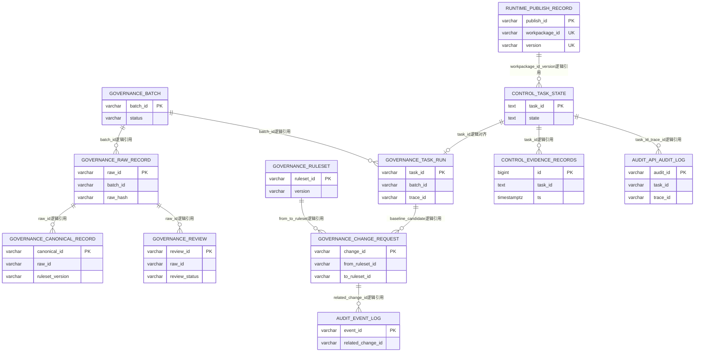

# 核心表结构设计

> 文档状态：当前有效
> 角色：系统正式数据库表结构与 E-R 设计说明
> 适用范围：`governance / runtime / control_plane / trust_meta / trust_data / audit / trust_db`
> 关联文档：
> - `docs/05_数据模型设计/数据模型总览.md`
> - `docs/05_数据模型设计/数据库分域设计.md`
> - `docs/05_数据模型设计/数据库跨界约束.md`
> - `docs/05_数据模型设计/可信数据数据库契约设计.md`
> - `docs/04_系统组件设计/04_数据与人工介入/数据存储体系设计.md`
> - `docs/04_系统组件设计/03_Runtime执行/Runtime调度与任务系统.md`

## 1. 文档定位与实现真相源

这份文档现在回答六件事：

1. 当前 Ring1 正式数据库域里到底有哪些表。
2. 各表的主键、唯一约束、物理外键和逻辑引用是什么。
3. 当前已经落成的物理表结构与仍在兼容收敛中的列差异是什么。
4. `governance / runtime / control_plane / trust_meta / trust_data / audit / trust_db` 七个域之间如何串起来。
5. 哪些数据库对象只是兼容层或局部存储，不应当作当前正式真相源。
6. 后续数据库迁移应优先补哪些约束与索引。

当前实现真相源按优先级收敛为：

1. Alembic 迁移：
   - [`migrations/versions/20260227_0004_runtime_publish_record_physical.py`](../../migrations/versions/20260227_0004_runtime_publish_record_physical.py)
   - [`migrations/versions/20260227_0005_governance_audit_physical_tables.py`](../../migrations/versions/20260227_0005_governance_audit_physical_tables.py)
   - [`migrations/versions/bd518515a0fe_init_trust_meta_tables_with_composite_pk.py`](../../migrations/versions/bd518515a0fe_init_trust_meta_tables_with_composite_pk.py)
2. Runtime bootstrap 建表：
   - [`src/runtime/state_store.py`](../../src/runtime/state_store.py)
   - [`src/runtime/evidence_store.py`](../../src/runtime/evidence_store.py)
3. 可信数据 canonical SQL 与 bootstrap：
   - [`database/trust_meta_schema.sql`](../../database/trust_meta_schema.sql)
   - [`services/trust_data_hub/app/repositories/schema_bootstrap.py`](../../services/trust_data_hub/app/repositories/schema_bootstrap.py)
4. 当前正式文档口径：
   - [数据库分域设计](数据库分域设计.md)
   - [可信数据数据库契约设计](可信数据数据库契约设计.md)

阅读本文件时要严格区分三类关系：

1. 物理外键：数据库已经声明 `FOREIGN KEY`。
2. 逻辑引用：业务已经依赖，但当前还没有显式外键约束。
3. 兼容层对象：为了历史迁移、旧接口或 bootstrap 收敛保留，不代表新设计应继续扩散。

## 2. 当前数据库对象分层

| 对象层 | 范围 | 当前落成方式 | 设计含义 |
|---|---|---|---|
| 正式物理表 | `governance.*`、`runtime.publish_record`、`audit.*`、`trust_meta` 主表 | Alembic / canonical SQL | 当前 Ring1 真相源 |
| bootstrap 正式表 | `control_plane.task_state`、`control_plane.evidence_records`、`trust_meta.capability_registry`、`trust_data.*` | 运行时启动 / Trust Hub bootstrap | 虽非 Alembic 主迁移，但已经进入正式主链 |
| 过渡物理底座 | `trust_db.*` | 历史表 + 字段补齐 | 只做兼容底座，不再是正式消费入口 |
| 兼容视图 | `public.addr_*`、早期 `trust_data.*` view | 迁移兼容 | 只为平滑过渡，不是正式表结构设计目标 |
| 局部工具存储 | `control_plane_<hash>.*`、`factory_*`、`skill_registry` 等 | 局部脚本 / 单体工具自建 | 不纳入当前系统级 Ring1 数据库设计 |

当前统一的表结构约定如下：

1. 主标识优先使用 `TEXT / VARCHAR(64|128)`，避免跨语言 UUID 类型差异。
2. 所有正式时间字段优先使用 `TIMESTAMPTZ`。
3. 结构化扩展字段优先使用 `JSONB`；当前 `control_plane.task_state.payload_json` 与 `control_plane.evidence_records.metadata_json` 仍是 `TEXT`，属于待收敛点。
4. 正式业务真相源与控制面真相源必须分表，不允许把 `control_plane.*`、`audit.*` 当业务结果主表。

## 3. 系统主链 E-R 图

图说明：这张图覆盖发布、执行、治理、人工审核和审计主链。图中同时存在物理外键与逻辑引用，关系标签已显式说明。

## 4. 可信数据域 E-R 图

图说明：这张图覆盖可信来源、快照、质量报告、激活版本、能力目录和标准查询表。`trust_db.*` 作为过渡底座不再纳入正式写路径，因此不在图中展开。

```mermaid
erDiagram
  TRUST_SOURCE_REGISTRY {
    text namespace_id PK
    text source_id PK
    text name
  }
  TRUST_SOURCE_SCHEDULE {
    text namespace_id PK
    text source_id PK
    text schedule_type
  }
  TRUST_SOURCE_SNAPSHOT {
    text namespace_id PK
    text snapshot_id PK
    text source_id
  }
  TRUST_SNAPSHOT_QUALITY_REPORT {
    text namespace_id PK
    text snapshot_id PK
    int quality_score
  }
  TRUST_SNAPSHOT_DIFF_REPORT {
    text namespace_id PK
    text new_snapshot_id PK
    text diff_severity
  }
  TRUST_ACTIVE_RELEASE {
    text namespace_id PK
    text source_id PK
    text active_snapshot_id
  }
  TRUST_CAPABILITY_REGISTRY {
    text capability_id PK
    text source_id
    text endpoint UK
  }
  TRUST_VALIDATION_REPLAY_RUN {
    text replay_id PK
    text namespace_id
    text snapshot_id
  }
  TRUST_DATA_ADMIN_DIVISION {
    text namespace_id PK
    text adcode PK
    text source_id PK
    text snapshot_id PK
  }
  TRUST_DATA_ROAD_INDEX {
    text namespace_id PK
    text road_id PK
    text source_id PK
    text snapshot_id PK
  }
  TRUST_DATA_POI_INDEX {
    text namespace_id PK
    text poi_id PK
    text source_id PK
    text snapshot_id PK
  }
  TRUST_DATA_PLACE_NAME_INDEX {
    text namespace_id PK
    text place_id PK
    text source_id PK
    text snapshot_id PK
  }
  TRUST_DATA_SAMPLE_DATA {
    text sample_id PK
    text source_id
  }

  TRUST_SOURCE_REGISTRY ||--|| TRUST_SOURCE_SCHEDULE : 物理FK
  TRUST_SOURCE_REGISTRY ||--o{ TRUST_SOURCE_SNAPSHOT : 物理FK
  TRUST_SOURCE_REGISTRY ||--o{ TRUST_ACTIVE_RELEASE : 物理FK
  TRUST_SOURCE_REGISTRY ||--o{ TRUST_CAPABILITY_REGISTRY : source_id逻辑引用
  TRUST_SOURCE_SNAPSHOT ||--o| TRUST_SNAPSHOT_QUALITY_REPORT : 物理FK
  TRUST_SOURCE_SNAPSHOT ||--o{ TRUST_SNAPSHOT_DIFF_REPORT : 物理FK
  TRUST_SOURCE_SNAPSHOT ||--o{ TRUST_VALIDATION_REPLAY_RUN : 物理FK
  TRUST_SOURCE_SNAPSHOT ||--o| TRUST_ACTIVE_RELEASE : active_snapshot_id物理FK
  TRUST_SOURCE_SNAPSHOT ||--o{ TRUST_DATA_ADMIN_DIVISION : snapshot_id逻辑引用
  TRUST_SOURCE_SNAPSHOT ||--o{ TRUST_DATA_ROAD_INDEX : snapshot_id逻辑引用
  TRUST_SOURCE_SNAPSHOT ||--o{ TRUST_DATA_POI_INDEX : snapshot_id逻辑引用
  TRUST_SOURCE_SNAPSHOT ||--o{ TRUST_DATA_PLACE_NAME_INDEX : snapshot_id逻辑引用
  TRUST_SOURCE_REGISTRY ||--o{ TRUST_DATA_SAMPLE_DATA : source_id逻辑引用
```

## 5. 当前正式与过渡表总览

当前 Ring1 口径纳入 29 张正式/正式化表，以及 4 张过渡底座表：

| 域 | 表组 |
|---|---|
| `governance` | `batch`、`task_run`、`raw_record`、`canonical_record`、`review`、`ruleset`、`change_request`、`observation_event`、`observation_metric`、`alert_event` |
| `runtime` | `publish_record` |
| `control_plane` | `task_state`、`evidence_records` |
| `audit` | `event_log`、`api_audit_log` |
| `trust_meta` | `source_registry`、`source_schedule`、`source_snapshot`、`snapshot_quality_report`、`snapshot_diff_report`、`active_release`、`capability_registry`、`audit_event`、`validation_replay_run` |
| `trust_data` | `admin_division`、`road_index`、`poi_index`、`place_name_index`、`sample_data` |
| `trust_db`（过渡） | `admin_division`、`road_index`、`poi_index`、`place_name_index` |

## 6. 治理业务域表结构

### 6.1 主链与审核表

| 表 | 主键 / 唯一 | 物理外键 | 逻辑引用 | 核心字段组 | 设计说明 |
|---|---|---|---|---|---|
| `governance.batch` | PK `batch_id` | 无 | 被 `raw_record.batch_id`、`task_run.batch_id` 引用 | `batch_name`、`source`、`status`、`created_at`、`updated_at` | 批次真相源 |
| `governance.raw_record` | PK `raw_id` | 无 | `batch_id -> batch` | `raw_text`、`province/city/district/street/detail`、`raw_hash`、`ingested_at` | 输入真相源，建议补 `batch_id + raw_hash` 索引 |
| `governance.task_run` | PK `task_id` | 无 | `batch_id -> batch`、`task_id <-> control_plane.task_state`、`trace_id -> observation_event / api_audit_log` | `status`、`retry_count`、`error_code`、`error_message`、`trace_id`、`agent_run_id`、`runtime`、`created_at`、`finished_at` | 业务执行实例真相源 |
| `governance.canonical_record` | PK `canonical_id` | 无 | `raw_id -> raw_record`、`ruleset_version -> ruleset.version`、`trace_id -> observation_event` | `canon_text`、地址部件列、`confidence`、`strategy`、`evidence`、`ruleset_version`、`agent_run_id`、`created_at`、`updated_at` | 规范结果真相源 |
| `governance.review` | PK `review_id` | 无 | `raw_id -> raw_record` | `review_status`、`final_canon_text`、`reviewer`、`comment`、`reviewed_at`、`created_at`、`updated_at` | 人工最终结论 |
| `governance.ruleset` | PK `ruleset_id` | 无 | 被 `change_request.from_ruleset_id / to_ruleset_id`、`observation_event.ruleset_id` 逻辑引用 | `version`、`is_active`、`config_json`、`created_by`、`created_at`、`updated_at` | 规则配置与版本载体 |
| `governance.change_request` | PK `change_id` | 无 | `from_ruleset_id / to_ruleset_id -> ruleset`、`baseline_task_id / candidate_task_id -> task_run` | `diff_json`、`scorecard_json`、`recommendation`、`status`、`approved_by`、`approved_at`、`review_comment`、`evidence_bullets`、`created_at`、`updated_at` | 规则变更审批真相源 |

### 6.2 观测与告警表

| 表 | 主键 / 唯一 | 物理外键 | 逻辑引用 | 核心字段组 | 设计说明 |
|---|---|---|---|---|---|
| `governance.observation_event` | PK `event_id` | 无 | `task_id -> task_run`、`workpackage_id -> runtime.publish_record`、`ruleset_id -> ruleset` | `trace_id`、`span_id`、`source_service`、`event_type`、`status`、`severity`、`payload_json`、`created_at` | 事件型观测数据 |
| `governance.observation_metric` | PK `metric_id` | 无 | 无 | `metric_name`、`metric_value`、`labels_json`、`window_start`、`window_end`、`created_at` | 指标型观测数据 |
| `governance.alert_event` | PK `alert_id` | 无 | `task_id -> task_run`、`trace_id -> observation_event`、`workpackage_id -> runtime.publish_record` | `alert_rule`、`severity`、`status`、`trigger_value`、`threshold_value`、`owner`、`ack_by`、`ack_at`、`created_at`、`updated_at` | 告警事件真相源 |

## 7. 发布、控制与审计域表结构

| 表 | 主键 / 唯一 | 物理外键 | 逻辑引用 | 核心字段组 | 设计说明 |
|---|---|---|---|---|---|
| `runtime.publish_record` | PK `publish_id`；UK `workpackage_id + version` | 无 | 被 `control_plane.task_state.payload_json`、`observation_event.workpackage_id` 逻辑引用 | `workpackage_id`、`version`、`status`、`evidence_ref`、`bundle_path`、`published_by`、`confirmation_user`、`confirmation_decision`、`confirmation_timestamp`、`published_at`、`created_at`、`updated_at` | 版本态真相源 |
| `control_plane.task_state` | PK `task_id` | 无 | `task_id <-> governance.task_run`；`payload_json` 中可引用 `workpackage_id@version`、审批信息、错误摘要 | `state`、`payload_json`、`updated_at` | 执行控制态真相源；`payload_json` 当前是 `TEXT` |
| `control_plane.evidence_records` | PK `id` | 无 | `task_id -> task_state` | `ts`、`actor`、`action`、`artifact_ref`、`result`、`metadata_json` | 执行证据真相源；当前已有 `task_id + ts` 索引；`metadata_json` 当前是 `TEXT` |
| `audit.event_log` | PK `event_id` | 无 | `related_change_id -> governance.change_request` | `event_type`、`caller`、`payload`、`related_change_id`、`created_at` | 关键动作审计留痕 |
| `audit.api_audit_log` | PK `audit_id` | 无 | `task_id -> governance.task_run / control_plane.task_state`、`trace_id -> observation_event` | `route`、`method`、`status_code`、`trace_id`、`task_id`、`actor`、`message`、`created_at` | API 级审计留痕 |

## 8. 可信元数据域表结构

### 8.1 正式表

| 表 | 正式主键 / 唯一 | 物理外键 | 逻辑引用 | 核心字段组 | 设计说明 |
|---|---|---|---|---|---|
| `trust_meta.source_registry` | PK `(namespace_id, source_id)` | 无 | 被 `source_schedule`、`source_snapshot`、`active_release`、`capability_registry`、`trust_data.sample_data` 引用 | `name`、`category`、`trust_level`、`license`、`entrypoint`、`update_frequency`、`fetch_method`、`parser_profile`、`validator_profile`、`enabled`、`allowed_use_notes`、`access_mode`、`robots_tos_flags`、`created_at`、`updated_at` | 来源元数据根对象 |
| `trust_meta.source_schedule` | PK `(namespace_id, source_id)` | FK `(namespace_id, source_id) -> source_registry` | 无 | `schedule_type`、`schedule_spec`、`window_policy`、`enabled` | 来源调度与窗口策略 |
| `trust_meta.source_snapshot` | PK `(namespace_id, snapshot_id)` | FK `(namespace_id, source_id) -> source_registry` | 被 `active_release`、`snapshot_quality_report`、`snapshot_diff_report`、`validation_replay_run`、`trust_data.*` 引用 | `source_id`、`version_tag`、`fetched_at`、`etag`、`last_modified`、`content_hash`、`raw_uri`、`parsed_uri`、`parsed_payload`、`status`、`row_count` | 快照版本真相源 |
| `trust_meta.snapshot_quality_report` | 正式键 `(namespace_id, snapshot_id)` | FK `(namespace_id, snapshot_id) -> source_snapshot` | 无 | `report_json`、`quality_score`、`validator_version` | 每个快照的质量报告 |
| `trust_meta.snapshot_diff_report` | 正式键 `(namespace_id, new_snapshot_id)` | FK `(namespace_id, base_snapshot_id) -> source_snapshot`；FK `(namespace_id, new_snapshot_id) -> source_snapshot` | 无 | `base_snapshot_id`、`new_snapshot_id`、`diff_json`、`diff_severity` | 快照差异分析 |
| `trust_meta.active_release` | 正式键 `(namespace_id, source_id)` | FK `(namespace_id, source_id) -> source_registry`；FK `(namespace_id, active_snapshot_id) -> source_snapshot` | 被 Agent、Runtime、查询服务读取 | `active_snapshot_id`、`activated_by`、`activated_at`、`activation_note` | 正式激活版本口径 |
| `trust_meta.capability_registry` | PK `capability_id`；UK `(source_id, endpoint)` | 无 | `source_id -> source_registry.source_id` | `provider`、`endpoint`、`tool_type`、`status`、`updated_at` | 能力目录；当前未携带 `namespace_id` |
| `trust_meta.audit_event` | PK `event_id` | 无 | `target_ref` 可逻辑引用 `source_registry / source_snapshot / active_release / capability_registry` | `namespace_id`、`actor`、`action`、`target_ref`、`event_json`、`created_at` | 可信数据域内审计事件 |
| `trust_meta.validation_replay_run` | 正式键 `replay_id` | FK `(namespace_id, snapshot_id) -> source_snapshot` | 无 | `request_payload`、`replay_result`、`schema_version`、`created_at` | 校验回放与对账结果 |

### 8.2 当前兼容列与收敛说明

`trust_meta` 目前是最明显的“正式口径已定、物理列仍带兼容负担”的域，重点如下：

1. `source_snapshot`
   - 当前物理表除了正式字段，还保留 `source_name`、`record_count`、`size_bytes`、`checksum`、`storage_path`、`format`、`created_at`、`meta_info` 等兼容列。
2. `snapshot_quality_report`
   - 历史迁移里存在 `report_id`、`ruleset_version`、`total_records`、`valid_records`、`error_records`、`score`、`details`、`created_at` 等列。
   - 当前正式文档口径仍以 `(namespace_id, snapshot_id)` 为主键口径，旧列视为兼容统计列。
3. `snapshot_diff_report`
   - 历史迁移里存在 `diff_id`、`added_count`、`removed_count`、`modified_count`、`diff_summary`、`created_at` 等列。
   - 当前正式文档口径仍以 `(namespace_id, new_snapshot_id)` 为主键口径。
4. `active_release`
   - 历史迁移可能仍保留 `release_tag`、`promoted_at`、`promoted_by`。
   - 当前正式口径是 `(namespace_id, source_id) -> active_snapshot_id`。
5. `validation_replay_run`
   - 历史迁移可能仍保留 `run_id`、`ruleset_id`、`status`、`started_at`、`completed_at`、`result_summary`。
   - 当前正式口径是 `replay_id + request_payload + replay_result + schema_version + created_at`。

## 9. 可信查询域与过渡底座表结构

### 9.1 `trust_data` 正式查询域

| 表 | 正式主键 / 唯一 | 物理外键 | 逻辑引用 | 核心字段组 | 设计说明 |
|---|---|---|---|---|---|
| `trust_data.admin_division` | PK `(namespace_id, adcode, source_id, snapshot_id)` | 无 | `(namespace_id, source_id, snapshot_id) -> source_snapshot` | `name`、`level`、`parent_adcode`、`name_aliases`、`valid_from`、`valid_to`、`division_id`、`parent_id` | 行政区划正式查询口径；当前有 `namespace_id + name` 索引 |
| `trust_data.road_index` | PK `(namespace_id, road_id, source_id, snapshot_id)` | 无 | `(namespace_id, source_id, snapshot_id) -> source_snapshot` | `name`、`normalized_name`、`admin_adcode`、`geometry_ref`、`alias_names`、`adcode` | 道路索引正式查询口径；当前有 `namespace_id + normalized_name` 索引 |
| `trust_data.poi_index` | PK `(namespace_id, poi_id, source_id, snapshot_id)` | 无 | `(namespace_id, source_id, snapshot_id) -> source_snapshot` | `name`、`normalized_name`、`category`、`admin_adcode`、`centroid`、`adcode`、`lon`、`lat` | POI 正式查询口径；当前有 `namespace_id + normalized_name` 索引 |
| `trust_data.place_name_index` | PK `(namespace_id, place_id, source_id, snapshot_id)` | 无 | `(namespace_id, source_id, snapshot_id) -> source_snapshot` | `name`、`normalized_name`、`type`、`admin_adcode`、`centroid`、`confidence_hint`、`alias_names`、`category`、`adcode` | 地名正式查询口径 |
| `trust_data.sample_data` | PK `sample_id` | 无 | `source_id -> source_registry.source_id` | `source_id`、`trust_score`、`content_json`、`collected_at` | 样本与示例数据 |

### 9.2 `trust_db` 过渡底座域

| 表 | 当前主键 | 当前角色 | 关键字段组 | 设计说明 |
|---|---|---|---|---|
| `trust_db.admin_division` | PK `(namespace_id, source_id, division_id)` | 历史底座 | `name`、`level`、`parent_id`、`adcode`、`snapshot_id`，以及后补的 `parent_adcode`、`name_aliases`、`valid_from`、`valid_to` | 仍可能作为兼容来源，但新查询禁止直接依赖 |
| `trust_db.road_index` | PK `(namespace_id, source_id, road_id)` | 历史底座 | `name`、`alias_names`、`adcode`、`snapshot_id`，以及后补的 `normalized_name`、`geometry_ref`、`admin_adcode` | 与 `trust_data.road_index` 不应并列暴露 |
| `trust_db.poi_index` | PK `(namespace_id, source_id, poi_id)` | 历史底座 | `name`、`category`、`adcode`、`snapshot_id`、`lon`、`lat`，以及后补的 `normalized_name`、`centroid`、`admin_adcode` | 只作迁移兼容 |
| `trust_db.place_name_index` | PK `(namespace_id, source_id, place_id)` | 历史底座 | `name`、`alias_names`、`category`、`adcode`、`snapshot_id`，以及后补的 `normalized_name`、`type`、`centroid`、`confidence_hint`、`admin_adcode` | 只作迁移兼容 |

## 10. 当前已落地的关键约束与索引

### 10.1 已落地的物理约束

| 对象 | 已落地约束 |
|---|---|
| `runtime.publish_record` | 主键 `publish_id`；唯一约束 `workpackage_id + version` |
| `control_plane.evidence_records` | 主键 `id`；索引 `idx_evidence_task_ts(task_id, ts)` |
| `trust_meta.source_schedule` | `(namespace_id, source_id)` 外键到 `source_registry` |
| `trust_meta.source_snapshot` | `(namespace_id, source_id)` 外键到 `source_registry` |
| `trust_meta.snapshot_quality_report` | `(namespace_id, snapshot_id)` 外键到 `source_snapshot`；bootstrap 会补唯一索引 `uq_quality_ns_snapshot` |
| `trust_meta.snapshot_diff_report` | `base_snapshot_id / new_snapshot_id` 双外键到 `source_snapshot`；bootstrap 会补唯一索引 `uq_diff_ns_new_snapshot` |
| `trust_meta.active_release` | `(namespace_id, source_id)` 外键到 `source_registry`；`active_snapshot_id` 外键到 `source_snapshot`；bootstrap 会补唯一索引 `uq_active_release_ns_source` |
| `trust_meta.validation_replay_run` | `(namespace_id, snapshot_id)` 外键到 `source_snapshot`；索引 `idx_validation_replay_ns_created`、`idx_validation_replay_ns_snapshot`；唯一索引 `uq_replay_id` |
| `trust_meta.capability_registry` | 主键 `capability_id`；唯一约束 `(source_id, endpoint)` |
| `trust_data.admin_division` | 索引 `idx_trust_data_admin_division_ns_name(namespace_id, name)` |
| `trust_data.road_index` | 索引 `idx_trust_data_road_index_ns_name(namespace_id, normalized_name)` |
| `trust_data.poi_index` | 索引 `idx_trust_data_poi_index_ns_name(namespace_id, normalized_name)` |

### 10.2 建议优先补齐的约束与索引

当前正式设计建议继续补齐以下项目，但这些建议不等于已经在物理库落地：

1. 为 `governance.raw_record.batch_id`、`governance.task_run.batch_id` 增加到 `governance.batch.batch_id` 的外键或至少显式约束。
2. 为 `governance.canonical_record.raw_id`、`governance.review.raw_id` 增加到 `governance.raw_record.raw_id` 的外键。
3. 为 `governance.change_request` 增加到 `governance.ruleset`、`governance.task_run` 的外键。
4. 为 `audit.event_log.related_change_id` 增加到 `governance.change_request.change_id` 的外键。
5. 将 `control_plane.task_state.payload_json` 与 `control_plane.evidence_records.metadata_json` 从 `TEXT` 收敛到 `JSONB`。
6. 为 `governance.task_run(batch_id, status, created_at)`、`governance.canonical_record(raw_id, ruleset_version)`、`governance.review(raw_id, review_status)` 增加组合索引。
7. 为 `governance.observation_event(trace_id, task_id, created_at)` 与 `audit.api_audit_log(trace_id, task_id, created_at)` 增加排障索引。
8. 若后续允许多命名空间下同名 `source_id` 并存，`trust_meta.capability_registry` 应补 `namespace_id` 并升级为组合外键。
9. `trust_data.*` 应至少统一补 `(namespace_id, source_id, snapshot_id)` 的 lineage 查询索引，确保来源与版本回放成本可控。

## 11. 兼容层与非正式对象说明

以下对象存在于仓库或数据库初始化脚本中，但不纳入当前系统级 Ring1 数据库真相源：

1. `public.addr_*`
   - 是治理域和发布域的历史兼容视图 / 兼容表，不是新的正式表结构目标。
2. 早期 `trust_data.*` view
   - 只用于从 `trust_db.*` 平滑迁移到正式查询域。
3. `control_plane_<hash>.*`
   - 来自 [`database/agent_runtime_store.py`](../../database/agent_runtime_store.py) 的局部流程设计存储，不等于当前正式 `control_plane.*`。
4. `factory_*`
   - 来自 [`database/factory_db.py`](../../database/factory_db.py) 的独立示例 / 工具表，不属于当前多 Schema 正式架构。
5. `skill_registry`
   - 来自 [`database/skill_registry_schema.sql`](../../database/skill_registry_schema.sql) 的独立工具表，不属于当前正式主链数据库设计。

这意味着：

1. 新 Story、新接口、新页面不得把这些对象写入 Ring1 正式数据库设计。
2. 若后续要把其中任何对象升级为正式能力，必须先在 `数据库分域设计` 和本文件中完成升级归口。

## 12. 继续阅读

1. [数据库分域设计](数据库分域设计.md)
2. [数据库跨界约束](数据库跨界约束.md)
3. [可信数据数据库契约设计](可信数据数据库契约设计.md)
4. [工单与任务模型](工单与任务模型.md)
5. [审核与反馈模型](审核与反馈模型.md)
