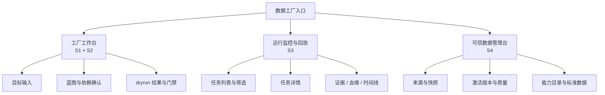
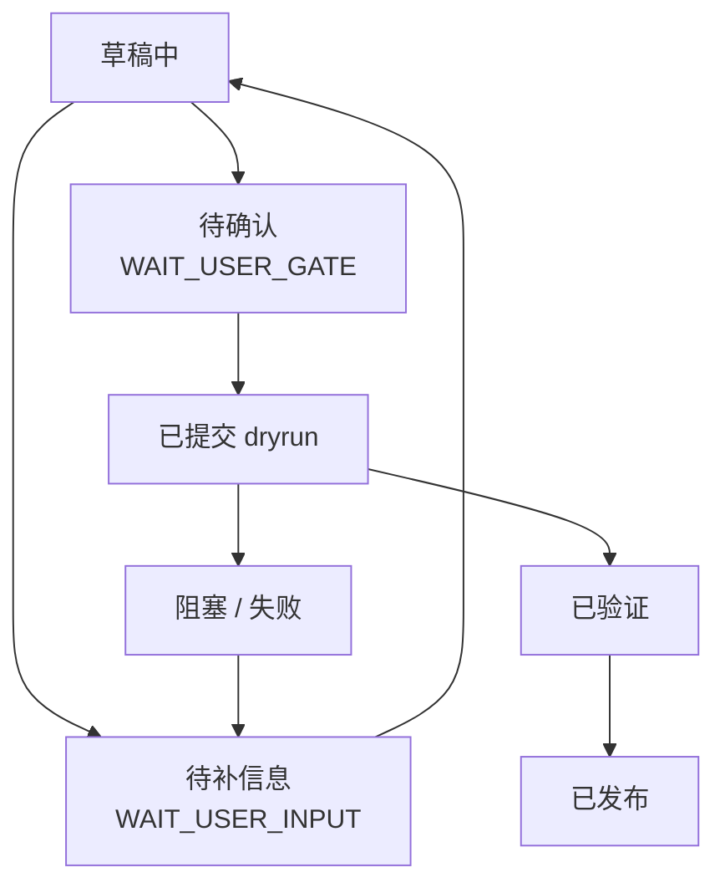

# 前端与交互总览

> 文档状态：当前有效
> 角色：系统前端与交互设计总入口
> 适用范围：页面信息架构、交互边界、跨页面状态、前端设计原则
> 关联文档：
> - `docs/01_产品与业务/系统场景与业务流程设计.md`
> - `docs/02_总体架构/系统总览.md`
> - `docs/04_系统组件设计/03_Runtime执行/Agent与Runtime交接契约.md`
> - `docs/04_系统组件设计/04_数据与人工介入/可信数据管理模块设计.md`

## 1. 设计目标

前端不是把后端接口“展示出来”，而是把系统的四条正式场景路径变成可操作、可判断、可追踪的界面：

1. 工厂工作台
   - 目标收敛、蓝图确认、dryrun、发布门禁
2. 运行监控与回放
   - 执行状态、结果摘要、证据、血缘、人工处置
3. 可信数据管理台
   - 来源、快照、激活版本、能力目录、标准查询数据

## 2. 前端信息架构图

图说明：这张图先看产品表面，不看内部服务。重点是三个工作面如何对应 `S1~S4` 场景。

## 3. 用户角色与页面权限

| 角色 | 主要页面 | 主要动作 | 禁止动作 |
|---|---|---|---|
| 治理发起人 | 工厂工作台、运行监控 | 提交目标、确认门禁、看结果 | 管理可信来源、改写审核结论 |
| 审核员 | 工厂工作台、运行监控 | 查看证据、人工复核、拒绝门禁 | 改写来源目录、发布快照 |
| 运维 / 值班 | 运行监控与回放 | 查状态、定位阻塞、回放链路 | 改写治理业务结果 |
| 可信数据管理员 | 可信数据管理台 | 登记来源、发布快照、维护能力目录 | 直接执行治理任务 |

## 4. 统一交互原则

1. 一个页面只负责一个主场景，不在单页里混入多个职责域。
2. 所有关键判断都要有“摘要 + 证据入口”，不能只给一行状态。
3. 页面不直连数据库，也不自己计算核心 KPI 或主状态。
4. 对用户可见的状态，优先用中文表达，英文只保留关键协议名、状态码和主键。
5. 页面上的“确认”动作必须区分：
   - 输入补齐
   - 门禁确认
   - 人工处置
   - 来源发布

## 5. 跨页面统一状态模型

图说明：这张图表达前端需要统一处理的主状态，不同页面可以展示不同子集，但不能自己发明另一套语义。

## 6. 前端边界

### 6.1 允许依赖

1. 正式 API / 聚合服务
2. 正式任务、门禁、回放、可信数据管理契约
3. 正式前端设计 token、状态模型、字段语义

### 6.2 禁止依赖

1. 页面直连 PostgreSQL
2. 页面把 `control_plane.*` 当主业务结果源
3. 页面把 `trust_db.*` 当正式来源
4. 页面直接调用第三方 provider 接口
5. 页面自己拼装发布门禁结论

## 7. 文档阅读顺序

1. [工厂工作台设计](工厂工作台设计.md)
2. [运行监控与回放设计](运行监控与回放设计.md)
3. [可信数据管理台设计](可信数据管理台设计.md)
