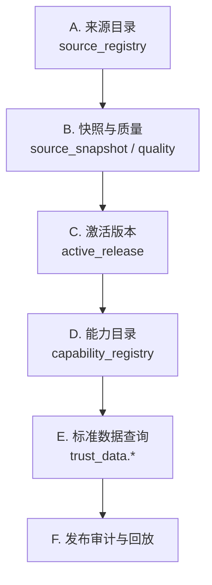
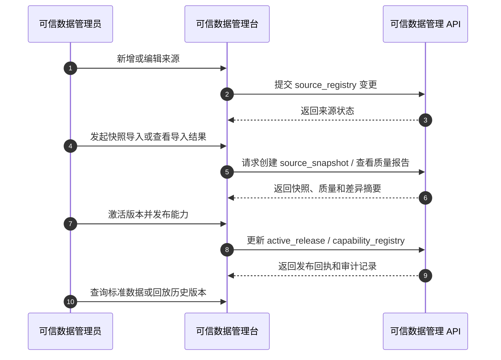

# 可信数据管理台设计

> 文档状态：当前有效
> 角色：可信数据管理模块的前端与交互设计
> 适用范围：来源登记、快照导入、激活版本、能力目录、标准数据查询
> 关联文档：
> - `docs/01_产品与业务/系统场景与业务流程设计.md`
> - `docs/04_系统组件设计/04_数据与人工介入/可信数据管理模块设计.md`
> - `docs/04_系统组件设计/04_数据与人工介入/可信数据API调用契约.md`
> - `docs/05_数据模型设计/可信数据数据库契约设计.md`

## 1. 页面定位

可信数据管理台服务于 `S4`，目标是把“来源、快照、能力目录、标准数据发布”做成一个正式工作面。

它不是治理结果页面，也不是运维日志页。

## 2. 页面结构图

图说明：这张图强调可信数据管理台必须按“来源 -> 快照 -> 发布 -> 能力 -> 查询”展开，避免把元数据维护和标准数据消费混成一个无序后台。

## 3. 核心操作流

图说明：可信数据管理员的正式操作路径应该是一条受控发布链，不是直接改数据库字段。

## 4. 页面模块说明

| 模块 | 主要动作 | 关键提示 |
|---|---|---|
| 来源目录 | 新增、编辑、停用来源 | 明确许可、采集方式、更新频率 |
| 快照与质量 | 导入、查看质量报告、查看差异 | 区分“导入成功”和“可发布” |
| 激活版本 | 选择激活快照、填写发布说明 | 发布会影响 Agent / Runtime 可见能力 |
| 能力目录 | 发布能力、停用能力、查看调用摘要 | 能力必须关联正式来源和版本 |
| 标准数据查询 | 查行政区划、道路、POI、样本数据 | 只做查询与验证，不做治理结果编辑 |

## 5. 页面边界

1. 可信数据管理台只通过管理 API 操作 `trust_meta / trust_data`。
2. 页面不允许出现“直接编辑 `trust_db.*`”的能力。
3. 页面不承载治理结果修正；治理结果修正属于人工审核流程。

## 6. 页面成功标准

1. 管理员可以完整完成“来源登记 -> 快照导入 -> 质量判断 -> 激活发布”闭环。
2. 页面能区分：
   - 来源状态
   - 快照状态
   - 激活状态
   - 能力可用状态
3. 页面上能直接看出某个能力来自哪个来源和哪个激活版本。
