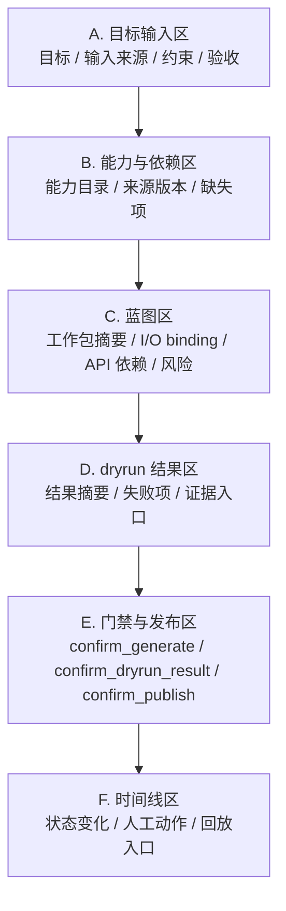
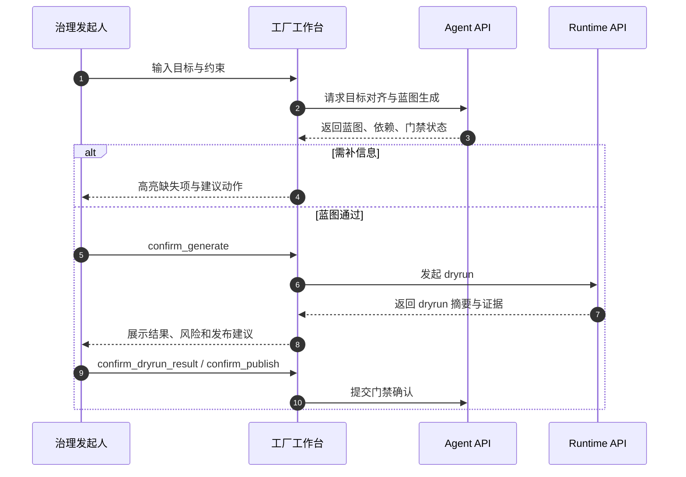

# 工厂工作台设计

> 文档状态：当前有效
> 角色：Factory Agent 主工作台交互设计
> 适用范围：目标收敛、蓝图确认、dryrun、门禁、发布
> 关联文档：
> - `docs/01_产品与业务/系统场景与业务流程设计.md`
> - `docs/04_系统组件设计/01_工厂Agent编排/工厂Agent状态机.md`
> - `docs/04_系统组件设计/03_Runtime执行/Agent与Runtime交接契约.md`

## 1. 页面定位

工厂工作台是 `S1 + S2` 的统一操作面。  
它不是“聊天页”，也不是“运行监控页”，而是：

1. 把治理目标变成工作包方案
2. 把工作包方案推进到 dryrun 与发布

## 2. 页面结构图

图说明：工作台必须按操作顺序从上到下展开，避免用户在一个平面里同时处理目标输入、蓝图确认、证据判断和发布动作。

## 3. 页面模块说明

| 区域 | 要显示什么 | 为什么必须存在 |
|---|---|---|
| 目标输入区 | 目标文本、输入方式、约束、验收标准 | 让用户确认“系统理解的是不是我想要的” |
| 能力与依赖区 | 当前可用能力、激活版本、缺 key/缺依赖 | 避免工作包在用户不知情时带着能力缺口继续走 |
| 蓝图区 | 工作包摘要、绑定方式、外部依赖、禁止项 | 让用户在生成前就能判断结构是否合理 |
| dryrun 结果区 | 结果统计、失败原因、证据与样例 | 支撑 `confirm_dryrun_result` |
| 门禁与发布区 | 当前门禁状态、操作按钮、确认记录 | 避免门禁动作散在多个页面 |
| 时间线区 | Agent / Runtime / 人工关键事件 | 让问题排查不需要跳页找日志 |

## 4. 关键交互流程

图说明：这张图重点看用户、页面、Agent API、Runtime API 如何围绕一个工作包反复推进，而不是把每个接口拆成独立表单。

## 5. 页面状态设计

| 页面状态 | 触发条件 | 页面行为 |
|---|---|---|
| 草稿中 | 目标刚输入，尚未生成蓝图 | 允许编辑目标与约束 |
| 待补信息 | Agent 返回 `WAIT_USER_INPUT` | 高亮缺失项，禁止继续进入 dryrun |
| 待确认 | 蓝图已通过但尚未确认 | 展示蓝图摘要、风险和确认入口 |
| dryrun 中 | Runtime 已接单 | 禁止重复提交，展示进度与时间线 |
| 待发布 | dryrun 已完成、证据可判定 | 展示结果摘要与发布确认 |
| 阻塞 / 失败 | 依赖缺失、执行失败、门禁拒绝 | 展示原因、恢复点和责任域 |
| 已发布 | 发布动作完成 | 展示回执、版本和运行入口 |

## 6. 交互细则

1. “补信息”和“确认门禁”必须是两类不同按钮和提示语。
2. 任何阻塞都要同时显示：
   - 原因码
   - 中文解释
   - 建议动作
   - 恢复点
3. 蓝图区必须显式展示：
   - `input_bindings`
   - `output_bindings`
   - `api_plan`
   - 禁止依赖
4. dryrun 结果至少提供：
   - 成功 / 失败数量
   - 关键失败样本
   - 证据入口
   - trace / task / publish 主键

## 7. 页面边界

1. 页面只调用 Agent / Runtime / 聚合 API。
2. 页面不直连数据库，也不直接查询第三方能力。
3. 页面显示的发布结论必须以后端门禁结果为准。
