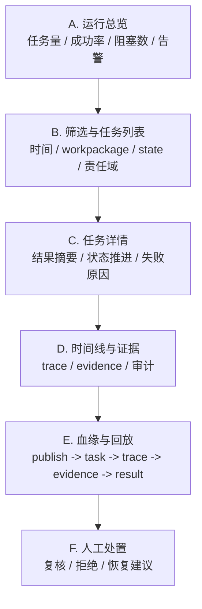
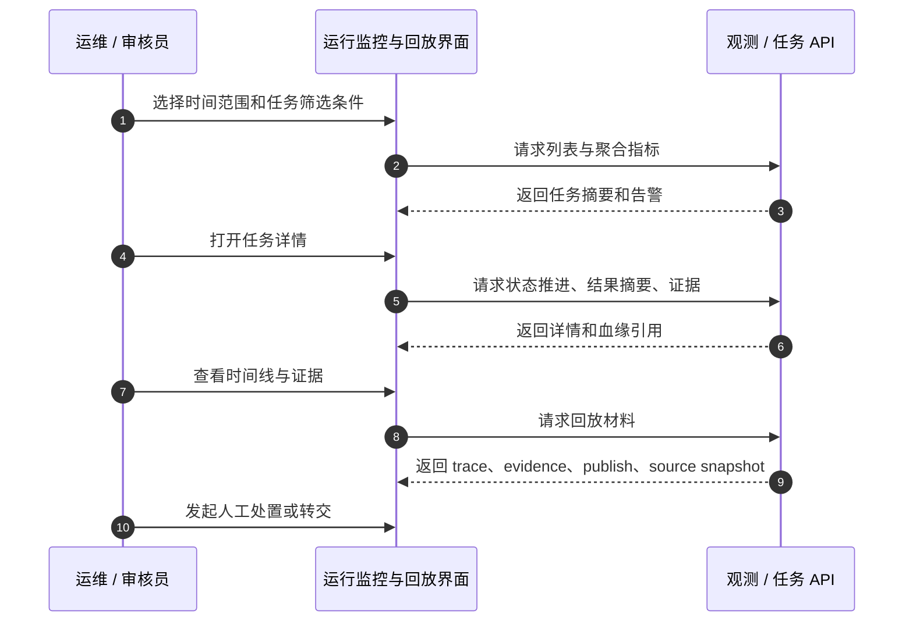

# 运行监控与回放设计

> 文档状态：当前有效
> 角色：运行态监控与回放界面设计
> 适用范围：任务列表、结果下钻、时间线、证据、血缘、人工处置
> 关联文档：
> - `docs/01_产品与业务/系统场景与业务流程设计.md`
> - `docs/04_系统组件设计/03_Runtime执行/Runtime调度与任务系统.md`
> - `docs/04_系统组件设计/03_Runtime执行/数据血缘与可追溯设计.md`
> - `docs/07_系统运行与运维/系统可观测性能力设计.md`

## 1. 页面定位

运行监控与回放页面服务于 `S3`：  
它的核心不是“看图表”，而是让人能从异常现象下钻到责任域和证据。

## 2. 页面结构图

图说明：这张图强调“总览在上，列表居中，详情在下钻层”。页面必须支持从任务摘要进入证据和血缘，而不是靠多页跳转拼凑。

## 3. 核心交互流程

图说明：一次典型排障过程应该是“筛选 -> 下钻 -> 看证据 -> 判断责任域 -> 做处置”，而不是只给用户一堆状态码。

## 4. 任务详情必须包含的内容

| 模块 | 最低要求 |
|---|---|
| 结果摘要 | 总记录数、成功数、失败数、关键失败类型 |
| 状态推进 | `publish -> task -> current_state` 与关键时间点 |
| 证据 | `evidence_ref`、关键事件、审计摘要 |
| 血缘 | `workpackage_id@version`、`publish_id`、`task_id`、`trace_id`、`source_snapshot_id` |
| 责任域 | Agent / Runtime / Worker / 可信数据 / 用户门禁 |

## 5. 页面边界

1. 页面主结论来自后端聚合 API，不由前端自己拼装。
2. 页面可以展示 `control_plane.*` 证据，但不能把它当治理结果主源。
3. 页面回放优先使用正式血缘引用，不从临时日志目录扫描构造链路。

## 6. 页面成功标准

1. 从任一异常任务可以在 3 步内进入证据详情。
2. 任一任务都能看到中文化的阻塞原因和责任域。
3. 关键主键和血缘引用可以被复制和继续检索。
