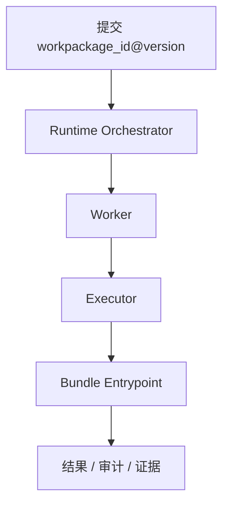

# 任务执行机制

> 角色：运行机制说明
> 来源：`docs/02_总体架构/系统总览.md`

## 1. 执行流程图

图说明：运行态从 `workpackage_id@version` 开始，只做任务执行，不参与工作包生成。

```mermaid
flowchart TD
  A["提交 workpackage_id@version"] --> B["Runtime Orchestrator"]
  B --> C["Worker"]
  C --> D["Executor"]
  D --> E["Bundle Entrypoint"]
  E --> F["结果 / 审计 / 证据"]
```

## 2. 机制说明

1. 运行时只认版本化工作包，不认临时脚本。
2. Worker 只执行入口文件。
3. 运行结果必须写回持久化与观测系统。
