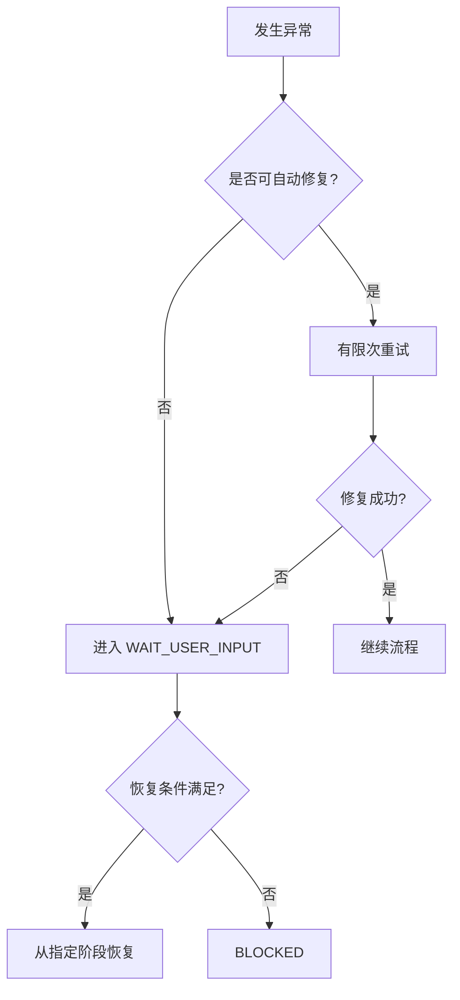

# 异常处理机制

> 角色：异常机制说明
> 来源：`docs/04_系统组件设计/01_工厂Agent编排/工厂Agent状态机.md`、`docs/02_总体架构/数据工厂技术架构.md`

## 1. 异常处理流程

图说明：异常处理遵循“先判断能否自动修复，再决定进入等待用户输入还是阻塞”的顺序。

## 2. 当前原则

1. 不允许 fallback 掩盖真实失败。
2. 自动修复必须有明确动作和重试上限。
3. 需要用户介入时，必须给出原因码、用户动作和恢复点。
