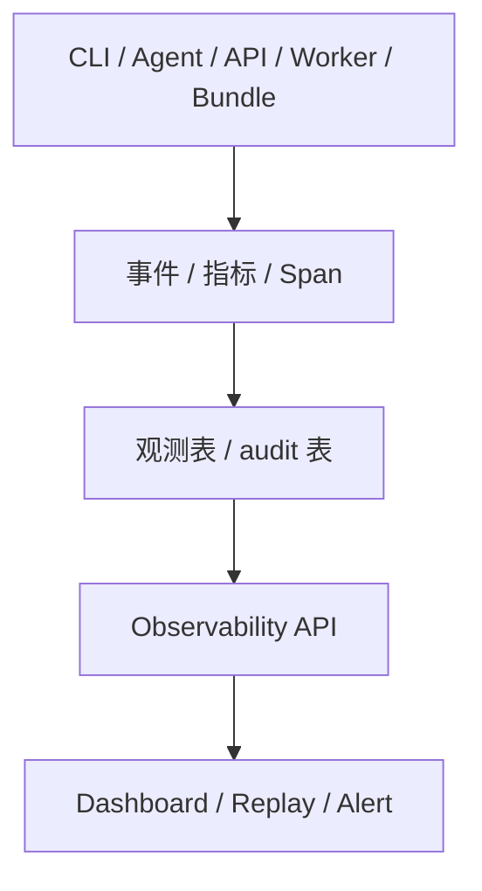

# 日志与监控

> 角色：观测说明
> 来源：`docs/07_系统运行与运维/系统可观测性能力设计.md`

## 1. 观测链路

图说明：日志、指标和事件最终要汇聚到统一观测接口，供 Dashboard、Replay 和告警消费。

## 2. 当前观测重点

1. 任务成功率、阻塞率、时延。
2. LLM 调用错误、发布失败、可信查询失败。
3. 人工确认超时与告警确认闭环。

## 3. 最小要求

1. 关键链路必须有 `trace_id`。
2. 失败必须有 machine-readable 状态。
3. Dashboard 要能按任务和 trace 回放。
