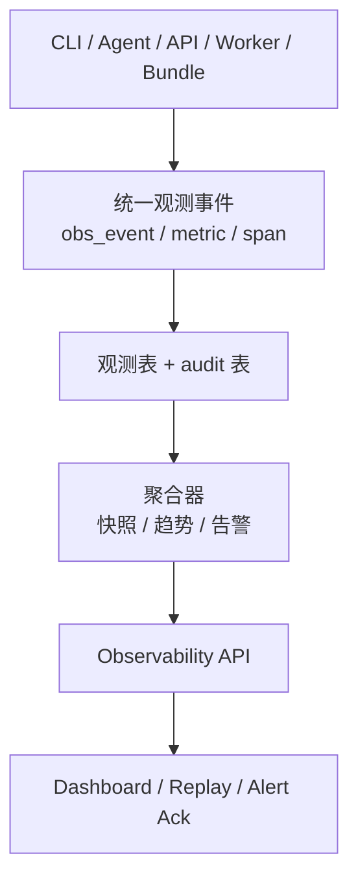

# 系统可观测性能力设计

> 文档状态：当前有效（专题设计）
> 角色：系统可观测性能力专题设计
> 使用规则：作为 `docs/02_总体架构/架构索引.md` 的专题补充，不替代架构真相源

## 1. 文档信息

- 文档版本：v1.0
- 创建日期：2026-02-27
- 适用范围：运行态观测、告警、回放与 Dashboard 正式能力设计
- 关联文档：
  - `docs/03_数据处理工艺/地址治理处理架构.md`
  - `docs/02_总体架构/架构索引.md`
  - `docs/02_总体架构/依赖关系.md`
  - `docs/99_研发过程管理/冲刺计划.md`
  - `services/governance_api/tests/test_observability_integration.py`

## 2. 设计目标

1. 建立统一可观测性模型，覆盖 `factory_cli -> factory_agent -> governance_api -> governance_worker -> address_core -> trust_hub` 全链路。
2. 保持 No-Fallback 原则：观测采集失败不能伪成功，必须产出 `blocked/error` 证据。
3. 打通“采集-聚合-查询-告警-回放”闭环，使阻塞/失败问题可定位、可回放、可审计。
4. 与现有 `/v1/governance/lab/observability/*` 能力保持兼容并逐步升级，不中断当前主链路交付。

## 3. 当前不纳入正式范围

1. 不引入重型外部可观测平台（如独立 ELK/Tempo 集群）作为硬依赖。
2. 不做多租户隔离和细粒度 RBAC。
3. 不以全量历史数据重刷作为当前正式能力前提，只要求支持持续采集和关键窗口查询。

## 4. 约束与原则

1. 强约束：关键链路事件必须有 `trace_id`、`event_id`、`status`、`timestamp`。
2. 强约束：任何 `fallback/degraded` 路径必须显式打标，且默认视为阻塞风险。
3. 强约束：读路径以 DB 为准；内存态只允许测试隔离场景。
4. 强约束：可观测接口返回必须可机读（JSON schema 固定）。

## 5. 架构总览

图说明：这张图强调观测能力不是单独平台，而是把采集、聚合、查询、告警和回放接到现有数据库域上形成闭环。

### 5.1 分层

1. 采集层（Instrumentation）
- 在 CLI、Agent、API、Worker、Core 统一埋点。
- 输出统一事件：`obs_event`、`obs_metric_point`、`obs_trace_span`。

2. 聚合层（Aggregation）
- 任务态聚合：成功率、阻塞率、时延分位、重试率、人工确认 SLA。
- 质量态聚合：低置信度占比、规则集质量门禁通过率、样例覆盖率。

3. 存储层（Storage）
- 现有正式域：`runtime.publish_record`、`control_plane.task_state`、`control_plane.evidence_records`、`audit.event_log`、`audit.api_audit_log`。
- 新增或显式收敛：`governance.observation_event`、`governance.observation_metric`、`governance.alert_event`。

4. 服务层（Query & Control）
- 统一查询 API：快照、趋势、明细、trace 回放、告警确认。
- 统一管控 API：告警 ack、降噪规则、SLO 配置读取。

5. 展示层（Dashboard）
- 复用 `lab/observability/view`，升级为“链路-指标-告警-回放”四栏布局。

### 5.2 关键流程

1. 事件流：业务动作 -> 观测事件 -> DB 持久化 -> 聚合 -> 快照接口。
2. 告警流：聚合器判定阈值越界 -> 写 `governance.alert_event` -> 管理看板展示 -> 人工确认。
3. 回放流：按 `trace_id/task_id/workpackage_id` 查询事件序列 -> 重建时间线 -> 输出故障根因线索。

## 6. 数据模型设计

### 6.1 `governance.observation_event`（新增）

字段建议：
- `event_id`（PK）
- `trace_id`（索引）
- `span_id`（可空）
- `source_service`（factory_cli/factory_agent/governance_api/governance_worker/address_core/trust_hub）
- `event_type`（llm_call/task_state_change/publish_attempt/trust_query/...）
- `status`（success/error/blocked）
- `severity`（info/warn/error/critical）
- `task_id`、`workpackage_id`、`ruleset_id`（可空）
- `payload_json`
- `created_at`

索引建议：
- `(trace_id, created_at DESC)`
- `(source_service, event_type, created_at DESC)`
- `(status, created_at DESC)`

### 6.2 `governance.observation_metric`（新增）

字段建议：
- `metric_id`（PK）
- `metric_name`（如 `task.success_rate`）
- `metric_value`
- `labels_json`（env/owner_line/workpackage_id/ruleset_id）
- `window_start`、`window_end`
- `created_at`

索引建议：
- `(metric_name, window_end DESC)`
- `GIN(labels_json)`（Postgres）

### 6.3 `governance.alert_event`（新增）

字段建议：
- `alert_id`（PK）
- `alert_rule`（如 `blocked_rate_high`）
- `severity`
- `status`（open/acked/resolved）
- `trigger_value`、`threshold_value`
- `trace_id`、`task_id`、`workpackage_id`（可空）
- `owner`
- `ack_by`、`ack_at`
- `created_at`、`updated_at`

## 7. API 契约设计

### 7.1 快照与趋势

1. `GET /v1/governance/observability/snapshot`
- 返回当前总览（SLA、质量门禁、阻塞态、告警态）。

2. `GET /v1/governance/observability/timeseries`
- 参数：`metric_name`、`window`、`group_by`。
- 返回时序点，供看板折线图。

### 7.2 事件与回放

1. `GET /v1/governance/observability/events`
- 参数：`trace_id/task_id/workpackage_id/status/event_type/limit`。

2. `GET /v1/governance/observability/traces/{trace_id}/replay`
- 返回按时间排序的事件序列和关键转折点。

### 7.3 告警管控

1. `GET /v1/governance/observability/alerts`
2. `POST /v1/governance/observability/alerts/{alert_id}/ack`

## 8. 指标体系（最小可用）

### 8.1 L1 业务可用性

1. `task_success_rate_5m`
2. `task_blocked_rate_5m`
3. `task_p95_latency_5m`

### 8.2 L2 质量与治理

1. `low_confidence_ratio_5m`
2. `quality_gate_pass_rate_5m`
3. `manual_confirmation_sla_breach_count`

### 8.3 L3 平台与链路

1. `llm_call_error_rate_5m`
2. `publish_blocked_count_5m`
3. `trust_query_error_rate_5m`

## 9. 告警规则（首批）

1. `blocked_rate_high`：5 分钟内 `blocked_rate > 0.15`。
2. `llm_error_burst`：1 分钟内 LLM error 连续 >= 5 次。
3. `publish_failure_streak`：同一 workpackage 连续发布失败 >= 3 次。
4. `confirmation_sla_timeout`：人工确认超 SLA 未处理。

## 10. 能力模块拆分

当前正式设计把可观测性能力拆成六类模块：

1. 统一事件模型与埋点
   - 统一事件结构、埋点字段和写库适配器。
2. 观测存储与查询接口
   - `snapshot / events / timeseries / alerts` 四类基础查询接口。
3. Trace 回放与故障定位
   - 按 `trace_id / task_id / workpackage_id` 重建执行时间线。
4. 告警引擎与确认闭环
   - 阈值判定、告警确认、审计留痕。
5. Dashboard 展示层
   - 以链路、指标、告警、回放四类视图组织页面。
6. 验收与门禁
   - 用可回放、可告警、可审计作为正式验收门。

## 11. 测试与验收门禁

1. 先测试后开发：每个 OBS Story 先补失败用例再实现。
2. 关键验收：
- 事件可追踪：任一任务可按 `trace_id` 回放全链路。
- 告警可闭环：告警可触发、可 ack、可审计。
- 无 fallback：观测组件异常必须可见，不得静默降级。

## 12. 与研发过程管理的关系

这份文档只定义正式能力结构，不负责排 Story 或周计划。  
具体的实施拆解、主题节奏和验收记录，统一放在：

1. `docs/99_研发过程管理/99_归档/截止2026-03-05/可观测性与PG一体化/`

## 13. 风险与缓解

1. 风险：观测写入放大影响主流程延迟。
- 缓解：异步批量写 + 限流 + 失败隔离队列（但状态可见）。

2. 风险：事件 schema 漂移导致看板字段断裂。
- 缓解：版本化 schema + 合约测试。

3. 风险：告警噪声过高。
- 缓解：分级阈值、抑制窗口、owner_line 路由。
