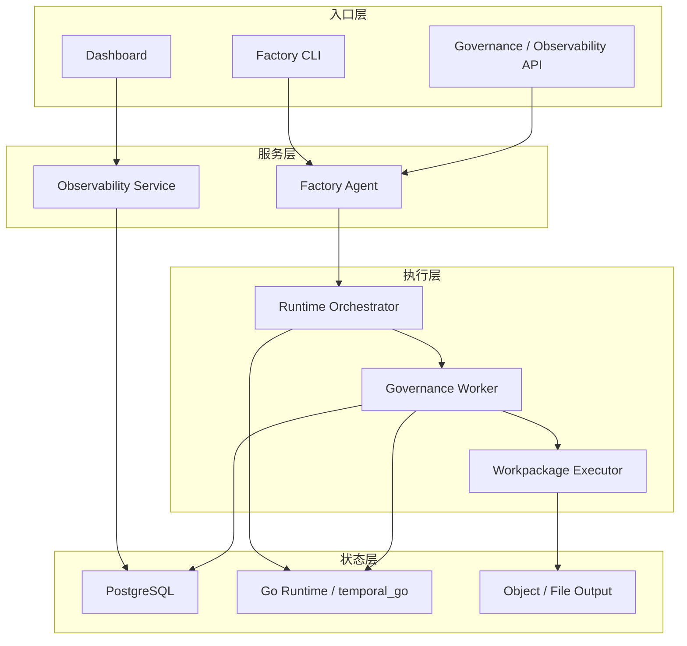

# 系统部署架构

> 文档状态：当前有效
> 角色：部署与运行拓扑正式说明
> 适用范围：服务部署、状态组件、发布与恢复、容量与运维基线
> 关联文档：
> - `docs/02_总体架构/系统总览.md`
> - `docs/04_系统组件设计/03_Runtime执行/Runtime调度与任务系统.md`
> - `docs/05_数据模型设计/数据库分域设计.md`

## 1. 部署架构回答什么

这份文档回答的是：

1. 系统由哪些可部署单元组成。
2. 状态组件如何分层。
3. 发布、回滚、备份和恢复的最低运维要求是什么。

## 2. 部署拓扑图

图说明：这张图按“入口层、服务层、执行层、状态层”展示当前最小生产拓扑，而不是代码模块图。

## 3. 部署单元

| 单元 | 作用 | 最小部署要求 |
|---|---|---|
| API 服务 | 对外暴露治理和观测接口 | 至少 1 个实例，可水平扩展 |
| Factory Agent 服务 | 目标对齐、发布编排 | 至少 1 个实例，需访问 PG 和 Runtime |
| Runtime Orchestrator | 任务状态推进和调度 | 至少 1 个实例，需访问 `Go Runtime / temporal_go` 控制引擎与 PG |
| Governance Worker | 执行工作包 | 可多实例横向扩展 |
| PostgreSQL | 主真相源 | 主链路必须可备份和恢复 |
| `Go Runtime / temporal_go` 控制引擎 | 控制推进与恢复协调 | 可重建，但丢失窗口需有补偿策略 |

## 4. 状态组件分层

1. PostgreSQL
   - 保存正式业务结果、发布记录、控制态和审计。
2. `Go Runtime / temporal_go` 控制引擎
   - 保存短期控制状态和执行协调上下文，不是最终真相源。
3. Output / Evidence
   - 保存运行产物与证据文件，但不能替代数据库真相源。

## 5. 发布与回滚

### 5.1 发布顺序

1. 先执行数据库迁移。
2. 再发布 API / Agent / Runtime。
3. 最后放量 Worker 或新工作包版本。

### 5.2 回滚规则

1. 服务回滚不能跳过数据库兼容性检查。
2. 工作包版本回滚必须按 `workpackage_id@version` 回退，不得直接覆盖 bundle 内容。
3. 回滚动作必须留下审计记录和操作人。

## 6. 备份与恢复

### 6.1 当前最低恢复目标

1. 业务域与发布域：需要可恢复。
2. 控制态与证据域：需要可重建或可补采。
3. 控制引擎上下文：允许瞬时丢失，但必须能从 PG 重新补齐任务状态。

### 6.2 恢复原则

1. 先恢复 PostgreSQL。
2. 再恢复 API / Agent / Runtime 服务。
3. 最后恢复 Worker 消费与证据归档。

## 7. 安全与隔离

1. 入口层与状态层之间只允许通过受控服务访问。
2. 页面不得直连数据库。
3. 密钥、Provider Token 和数据库连接串必须走环境变量或密钥管理，不落正式文档样例明文。

## 8. 容量与扩展基线

1. API、Agent、Worker 默认按无状态服务设计，优先水平扩展。
2. PostgreSQL 和 Runtime 控制引擎是有状态组件，扩展前必须先确认备份、恢复和监控口径。
3. 观测、审计和证据写入量上升时，应优先优化批量写和分区策略，而不是让页面直接读明细大表。
