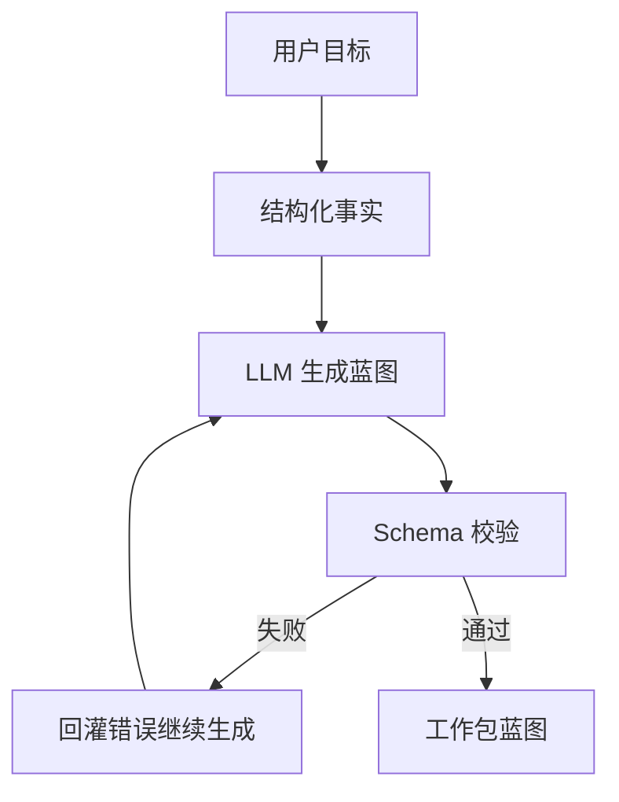

# LLM能力设计

> 角色：LLM 能力说明
> 来源：`docs/04_系统组件设计/01_工厂Agent编排/工厂Agent编排系统.md`、`docs/04_系统组件设计/01_工厂Agent编排/编排记忆与恢复设计.md`

## 1. LLM 在系统中的位置

LLM 的角色是“生成候选方案”，不是“直接决定系统状态”。

## 2. 能力闭环

图说明：LLM 只负责产出候选蓝图，是否进入下一阶段取决于 schema 校验和门禁。

## 3. 约束

1. 默认使用真实外部 LLM。
2. 不用 mock 链路替代真实能力验证。
3. LLM 输出必须通过 schema 和门禁。
