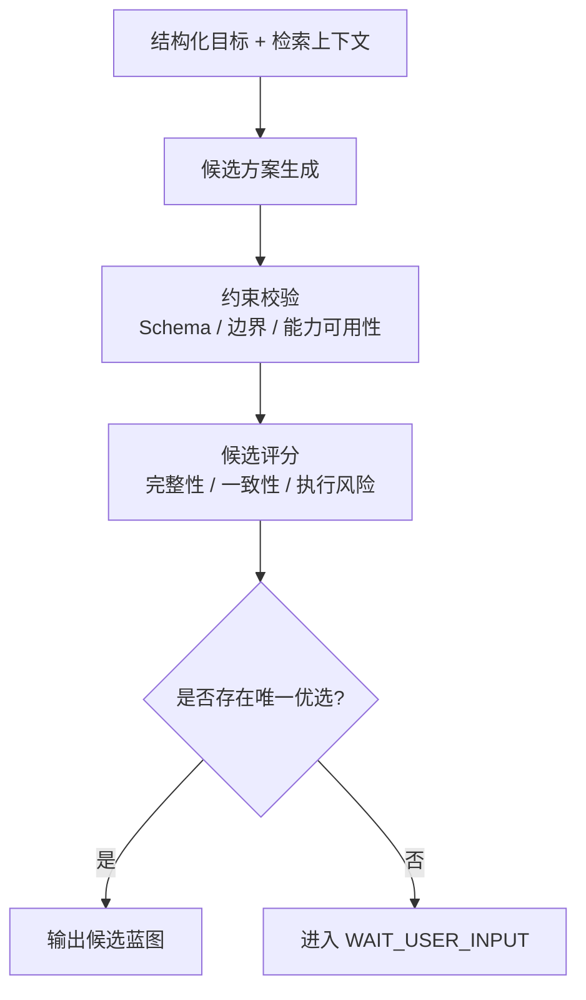

# 推理与排序策略

> 文档状态：当前有效
> 角色：AI 推理与候选排序正式设计
> 适用范围：目标收敛、工作包蓝图生成、候选结果裁决
> 关联文档：
> - `docs/08_AI能力设计/LLM能力设计.md`
> - `docs/04_系统组件设计/01_工厂Agent编排/工厂Agent状态机.md`

## 1. 推理与排序回答什么

系统不是拿到一个 LLM 输出就直接执行，而是必须回答：

1. 候选方案是否满足正式约束。
2. 多个候选里哪个更接近“可执行工作包”。
3. 什么情况下必须停止自动排序并交给用户。

## 2. 推理与排序链路

图说明：这张图从候选生成开始，展示约束校验、评分排序和人工升级的全过程。

## 3. 排序维度

| 维度 | 说明 |
|---|---|
| 约束满足度 | 是否满足 schema、模块边界、数据库跨界约束 |
| 能力匹配度 | 当前可用能力是否足够支撑 |
| 可执行性 | 是否能生成 reader / writer / entrypoint |
| 风险水平 | 是否依赖未确认前提、未注册能力、模糊 binding |
| 证据完整性 | 是否能解释为什么这么选 |

## 4. 停止自动排序的条件

以下情况必须停止自动排序并进入人工介入：

1. 候选方案在关键约束上同分，系统无法唯一裁决。
2. 多个候选都依赖未确认的外部能力或未补齐的 key。
3. 约束校验连续失败达到上限。

## 5. 工业化要求

1. 排序结果必须能解释，不允许“模型觉得这个更好”。
2. 排序前后的中间对象必须能进入 `blueprint_attempts` 或等价结构化记录。
3. 人工裁决触发条件必须与状态机原因码一致。
