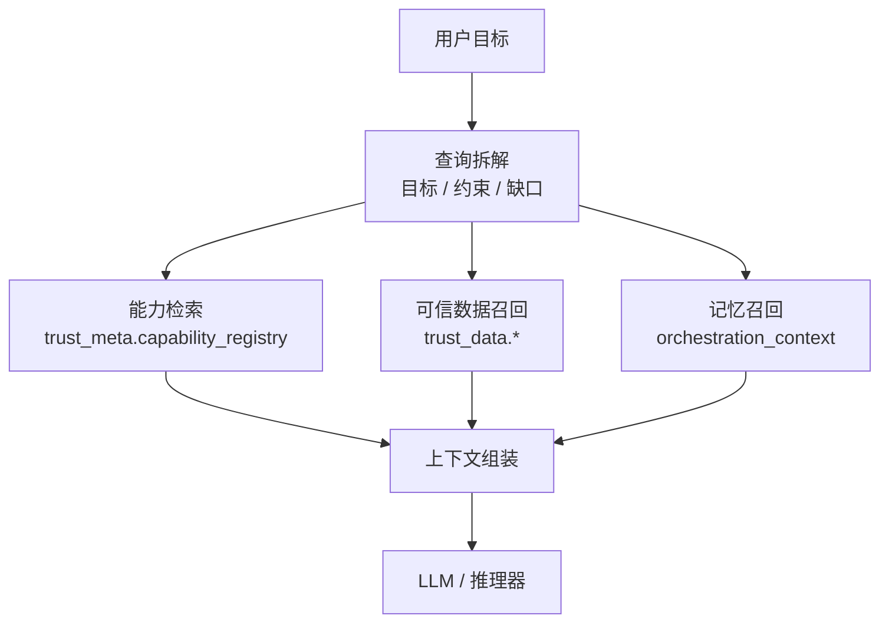

# 检索与召回机制

> 文档状态：当前有效
> 角色：AI 检索与召回正式设计
> 适用范围：Factory Agent、工作包生成、可信能力查询、上下文补全
> 关联文档：
> - `docs/08_AI能力设计/LLM能力设计.md`
> - `docs/04_系统组件设计/02_工作包协议/工作包Schema设计.md`
> - `docs/05_数据模型设计/数据库跨界约束.md`

## 1. 检索解决什么问题

LLM 本身不应裸奔。检索与召回机制负责在推理前补齐：

1. 当前可用能力
2. 正式约束与边界
3. 与任务直接相关的可信数据和历史记忆

## 2. 检索链路图

图说明：这张图展示 Agent 在推理前如何先做上下文召回，再把结构化上下文交给 LLM。

## 3. 正式召回源

当前允许的正式召回源包括：

1. `trust_meta.capability_registry`
2. `trust_meta.source_registry / source_snapshot / active_release`
3. `trust_data.*`
4. `orchestration_context` 中的结构化记忆对象
5. 正式工作包 Schema 与正式架构文档

禁止：

1. 直接从 `trust_db.*` 做新检索入口
2. 直接从历史归档文档抽取当前正式约束

## 4. 召回策略

| 层 | 目标 | 典型规则 |
|---|---|---|
| 精确召回 | 找到唯一能力、唯一 schema、唯一边界 | ID、路径、状态码精确匹配 |
| 约束召回 | 找到必须遵守的正式规则 | 先召回 Ring0 / Ring1 文档 |
| 可信召回 | 找到标准索引与可信样本 | 优先激活版本与高可信来源 |
| 记忆召回 | 找到当前会话必需的上下文 | 优先 `interaction_state / blocker_ticket / gate_state` |

## 5. 召回质量要求

1. 必须可解释：为什么召回了这些上下文。
2. 必须可过滤：不能把所有历史材料一股脑塞给 LLM。
3. 必须可审计：能力召回和可信数据查询需要留下摘要证据。

## 6. 工业化要求

1. 召回结果必须区分“正式真相源”和“过程参考材料”。
2. 召回失败必须可见，不能静默退化成纯自由推理。
3. 与数据库跨界约束冲突的召回源，应直接拒绝进入推理上下文。
