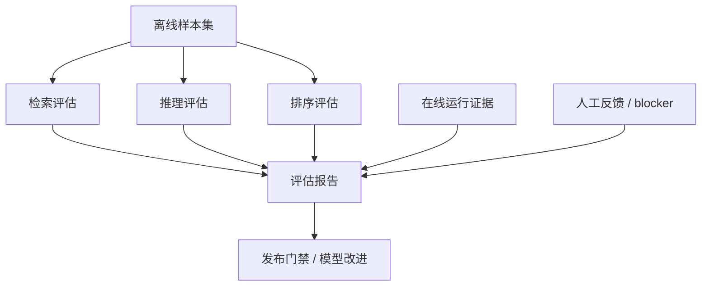

# 模型评估机制

> 文档状态：当前有效
> 角色：AI 能力评估与上线门禁说明
> 适用范围：LLM、检索、候选排序、工作包生成质量评估
> 关联文档：
> - `docs/08_AI能力设计/LLM能力设计.md`
> - `docs/08_AI能力设计/检索与召回机制.md`
> - `docs/08_AI能力设计/推理与排序策略.md`

## 1. 评估范围

当前 AI 能力评估至少覆盖三层：

1. 检索：是否召回了对的问题上下文
2. 推理：是否生成了结构正确、约束一致的候选
3. 排序：是否选出了真正可执行的方案

## 2. 评估闭环图

图说明：这张图展示离线样本、在线运行证据和人工反馈如何共同形成评估闭环。

## 3. 评估维度

| 维度 | 核心问题 |
|---|---|
| 结构正确率 | 输出是否符合 Schema |
| 约束一致率 | 是否违反边界、依赖、数据库跨界约束 |
| 召回命中率 | 必需上下文是否被召回 |
| 候选可执行率 | 候选是否可直接转成工作包蓝图 |
| 人工升级率 | 需要人工介入的比例是否异常升高 |

## 4. 上线门禁

1. 结构正确率不达标，不允许进入正式工作包生成链。
2. 约束一致率不达标，不允许靠人工兜底伪装成可上线。
3. 人工升级率异常升高，必须触发模型和提示词回看。

## 5. 评估产物

每次正式评估至少产出：

1. 样本范围
2. 指标结果
3. 失败样例分类
4. 是否允许继续发布的结论

这些产物应进入测试/验收或评审链路，而不是只留口头结论。
