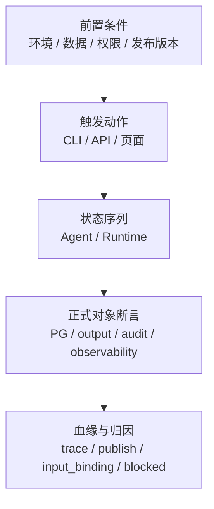

# E2E用例模板

> 文档状态：当前有效
> 角色：E2E 详细用例编写模板
> 适用范围：所有进入自动化实现、预发布验收或发布门禁的 E2E 用例
> 关联文档：
> - `docs/09_测试与验收/测试方案总览.md`
> - `docs/09_测试与验收/全链路测试设计.md`
> - `docs/04_系统组件设计/01_工厂Agent编排/工厂Agent状态机.md`
> - `docs/04_系统组件设计/03_Runtime执行/Runtime调度与任务系统.md`
> - `docs/04_系统组件设计/03_Runtime执行/数据血缘与可追溯设计.md`

## 1. 为什么要单独有模板

`全链路测试设计.md` 负责定义正式 E2E 用例目录和覆盖范围，但工业级落地还需要一层更细的详细用例规格。

每条进入实现或验收的 E2E 用例，至少要回答：

1. 前置环境是否满足。
2. 真实依赖是什么。
3. 触发动作是什么。
4. 期望经过哪些 Agent / Runtime 状态。
5. 哪些数据库对象、证据对象和血缘对象必须存在。
6. 如果失败，失败应该归因到哪个责任域。

## 2. 必填字段

| 字段 | 说明 |
|---|---|
| `用例 ID` | 必须与 `全链路测试设计.md` 中的 E2E ID 一致 |
| `目标` | 这条用例要证明哪条用户级闭环成立 |
| `风险类型` | 主链成功、阻塞、失败、人工介入、回放、发布、血缘等 |
| `优先级` | `P0 / P1 / P2` |
| `数据集` | 使用统一数据集编码，如 `DS-A` |
| `环境` | 至少写明 `E2E-RING0` 及额外依赖 |
| `前置条件` | 数据、配置、权限、版本、发布记录等 |
| `触发入口` | CLI / API / 管理页面 / 回放工具 |
| `执行步骤` | 人与系统的操作序列 |
| `Agent 状态序列` | 期望经过的 Agent 状态 |
| `Runtime 状态序列` | 期望经过的 Runtime 状态；如果本用例不涉及，写 `N/A` |
| `持久化断言` | 需要断言的 PG 对象、字段或记录 |
| `产物断言` | 需要断言的 `output/` 或对象存储产物 |
| `观测与审计断言` | `trace_id / evidence_ref / audit_event` 等 |
| `血缘断言` | `source_snapshot_id / input_binding_ref / publish_id / task_id / trace_id` 等 |
| `blocked/failed 归因` | 失败时必须归属于哪个责任域和原因码 |
| `通过标准` | 什么条件满足才算通过 |

## 3. 标准模板

图说明：这张图只说明一条 E2E 用例应该覆盖哪些信息层，不表达具体执行顺序。



```md
## E2E-XXX：<标题>

- 目标：
- 风险类型：
- 优先级：
- 数据集：
- 环境：

### 前置条件
1.
2.
3.

### 触发入口
1.

### 执行步骤
1.
2.
3.

### 期望 Agent 状态序列
1.
2.
3.

### 期望 Runtime 状态序列
1.
2.
3.

### 持久化断言
1.
2.
3.

### 产物断言
1.
2.

### 观测与审计断言
1.
2.
3.

### 血缘断言
1.
2.
3.

### blocked / failed 归因
- 责任域：
- 原因码：
- 恢复动作：

### 通过标准
1.
2.
3.
```

## 4. 填写规则

1. 不能只写“接口返回 200”，必须至少写一类 PG 对象断言和一类证据断言。
2. 只要涉及 Agent 编排，必须写 `Agent 状态序列`。
3. 只要进入 Runtime，必须写 `Runtime 状态序列`。
4. 只要结果进入正式验收，必须写 `血缘断言`。
5. `blocked` 不能写成笼统“依赖不可用”，必须落到责任域和原因码。
6. 一条用例如同时覆盖成功和拒绝两个分支，应拆成主用例和变体，不要把两个出口混写成一段话。

## 5. 示例

### 5.1 示例：`E2E-004` dryrun 成功后发布闭环

- 目标：验证用户从 dryrun 成功到 `confirm_publish` 完成的正式发布闭环。
- 风险类型：发布 / 门禁 / 回放。
- 优先级：`P0`
- 数据集：`DS-A`
- 环境：`E2E-RING0`

### 前置条件
1. `workpackage_id@version` 已存在，且蓝图已通过 schema 校验。
2. Runtime、Worker、PostgreSQL、Trust Hub 和真实外部 LLM 可用。
3. 发布前不存在同版本冲突记录。

### 触发入口
1. 通过 CLI 或 API 发起 dryrun，并在成功后执行 `confirm_dryrun_result` 与 `confirm_publish`。

### 执行步骤
1. 提交治理目标，生成工作包并发起 dryrun。
2. 等待 dryrun 完成并校验结果摘要。
3. 执行 `confirm_dryrun_result`。
4. 执行 `confirm_publish`。

### 期望 Agent 状态序列
1. `DISCOVERY`
2. `ALIGN_IO`
3. `BLUEPRINT_LOOP`
4. `BUILD_WITH_OPENCODE`
5. `VERIFY`
6. `WAIT_USER_GATE`
7. `PUBLISH`
8. `COMPLETED`

### 期望 Runtime 状态序列
1. `SUBMITTED`
2. `PLANNED`
3. `APPROVED`
4. `CHANGESET_READY`
5. `EXECUTING`
6. `EVALUATING`
7. `COMPLETED`

### 持久化断言
1. `runtime.publish_record` 中存在对应 `workpackage_id / version / publish_id`。
2. `control_plane.task_state` 中存在对应 `task_id` 的最终状态记录。
3. `governance.task_run` 与 `governance.canonical_record` 可按 `task_id` 或业务主键回查。

### 产物断言
1. `output/` 中存在执行证据或结果摘要产物。
2. 证据产物引用与 `evidence_ref` 一致。

### 观测与审计断言
1. 可按 `trace_id` 查询完整事件序列。
2. `control_plane.evidence_records` 中存在初始化、执行、完成三类关键事件。
3. 审计日志中存在发布确认动作。

### 血缘断言
1. 可从 `publish_id` 回查 `task_id`。
2. 可从 `task_id` 回查 `workpackage_id@version`。
3. 可从结果记录回查 `trace_id / evidence_ref`。

### blocked / failed 归因
- 责任域：发布门禁 / Runtime 执行 / 外部能力。
- 原因码：根据实际失败分型，不允许写泛化文本。
- 恢复动作：必须给出重新验证、补审批或修依赖的明确动作。

### 通过标准
1. Agent 与 Runtime 状态序列完整成立。
2. 发布记录、任务状态、结果、证据、血缘五类对象都可查询。
3. 所有关键 ID 可互相回查。
