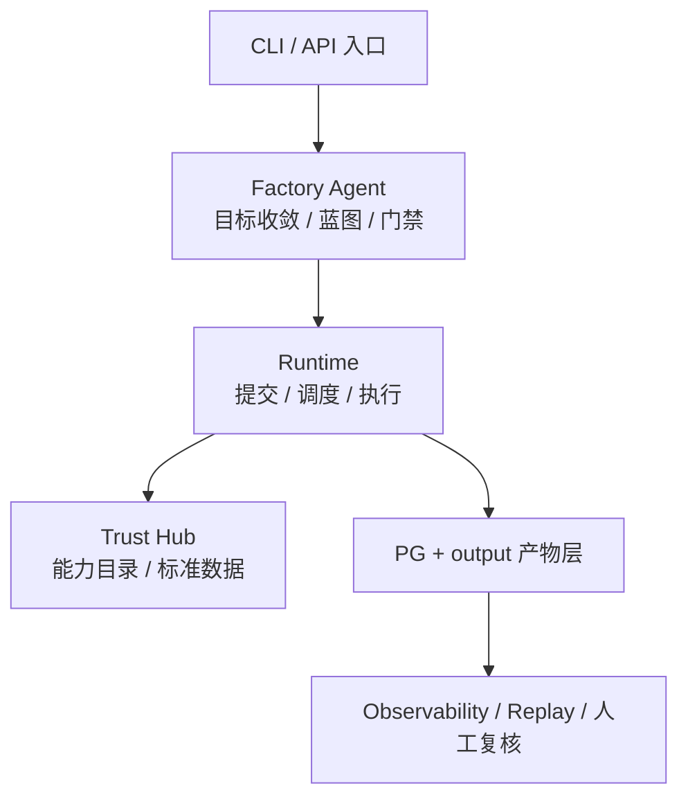
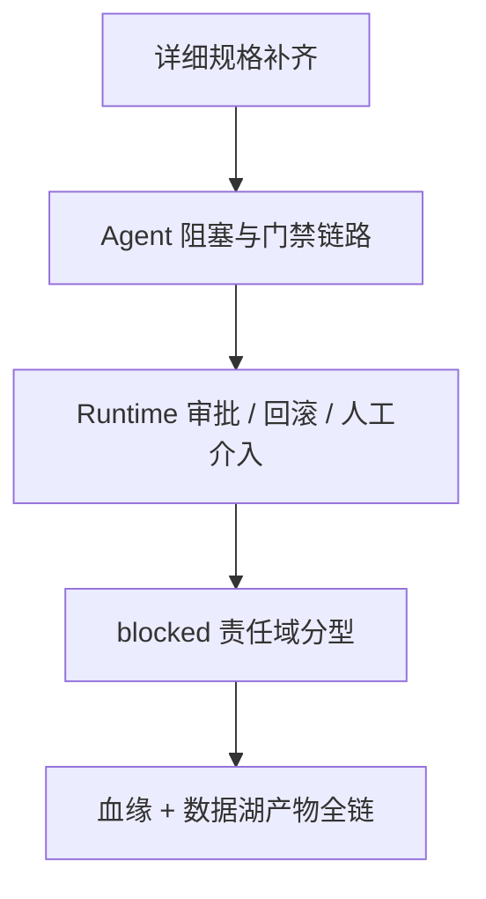

# 全链路测试设计

> 文档状态：当前有效
> 角色：E2E 测试设计
> 适用范围：CLI、Factory Agent、Runtime、Trust Hub、Observability、人工复核的真实主链路验证
> 关联文档：
> - `docs/09_测试与验收/测试方案总览.md`
> - `docs/03_数据处理工艺/地址治理处理架构.md`
> - `docs/04_系统组件设计/01_工厂Agent编排/工厂Agent编排系统.md`
> - `docs/04_系统组件设计/03_Runtime执行/Runtime调度与任务系统.md`
> - `docs/07_系统运行与运维/系统可观测性能力设计.md`

## 1. E2E 目标

E2E 测试只验证用户级闭环，不替代单元和集成测试。它重点回答：

1. 从用户输入到工作包发布、Runtime 执行、结果回写、证据回放是否真正跑通。
2. 真正的外部 LLM、正式 PG、正式血缘对象是否进入主链路。
3. 失败、人工介入和观测回放是否可见、可审计、可恢复。

## 2. E2E 执行链

图说明：这张图只看 E2E 测试执行对象，强调测试关注的是“主链闭环”和“失败可见”，不是单模块内部逻辑。

## 3. E2E 环境要求

1. PostgreSQL 可用。
2. Runtime、Worker、Factory Agent、API 可启动。
3. `output/` 产物目录可写。
4. 涉及 LLM 验证的场景必须配置真实外部 LLM。
5. 外部依赖不可用时，测试结果必须记为 `blocked`，不能伪通过。
6. `blocked` 结果必须区分责任域，至少明确是外部 LLM、关键 key、能力缺口还是基础设施不可用。

## 4. E2E 目录级用例设计（15 个）

| ID | 场景 | 数据集 | 关键断言 | 优先级 |
|---|---|---|---|---|
| `E2E-001` | CLI 提交地址治理目标，Agent 成功生成工作包蓝图 | `DS-A` | 生成结构化蓝图并进入 `confirm_generate` | P0 |
| `E2E-002` | 蓝图构建成功后发起 dryrun | `DS-A` | 生成 `workpackage_id@version`、创建 `task_id`、进入 Runtime | P0 |
| `E2E-003` | dryrun 执行成功并回写治理结果与证据 | `DS-A` | `records / spatial_graph / trace_id / evidence_ref` 全部可查 | P0 |
| `E2E-004` | dryrun 成功后通过门禁进入 publish | `DS-A` | `confirm_dryrun_result` 与 `confirm_publish` 生效，发布记录可查 | P0 |
| `E2E-005` | Blueprint 首轮 schema 失败后重新生成并成功 | `DS-B` | `blueprint_attempts` 记录失败与成功两轮 | P1 |
| `E2E-006` | 输入 binding 未闭合，系统进入 `WAIT_USER_INPUT` | `DS-C` | 生成 `interaction_state`、`blocker_ticket`、`resume_from_stage` | P0 |
| `E2E-007` | 缺关键依赖时系统返回 `blocked` 并区分责任域 | `DS-C` | 不伪成功；阻塞原因码、责任域和恢复动作完整可见 | P0 |
| `E2E-008` | Runtime 执行失败后进入 `FAILED` 并沉淀证据 | `DS-C` | `task_state`、`evidence_records`、`audit` 均有记录 | P0 |
| `E2E-009` | Runtime 进入 `NEEDS_HUMAN` 并通过人工复核恢复 | `DS-E` | 人工复核记录与后续恢复执行链路可追溯 | P1 |
| `E2E-010` | file binding 地址批处理链路跑通 | `DS-F` | 文件输入、文件/DB 输出、证据产物一致 | P0 |
| `E2E-011` | database binding 地址批处理链路跑通 | `DS-F` | 从 DB 读入、向正式表写出、分页查询可回查 | P0 |
| `E2E-012` | Trust Hub 提供标准数据增强并进入结果证据 | `DS-G` | 来源快照、查询摘要和结果证据关联完整 | P1 |
| `E2E-013` | Observability snapshot 与 trace replay 闭环 | `DS-H` | 可按 `task_id / trace_id` 查询快照、事件、回放序列 | P0 |
| `E2E-014` | 发布后按 `workpackage_id@version` 回放指定执行链 | `DS-F` | `publish_record -> task_state -> evidence -> result` 全链可回查 | P1 |
| `E2E-015` | 从 `canonical_record` 逆向追踪 `raw_record`、`task_id`、`publish_id` | `DS-F` | 血缘查询链完整成立 | P0 |

## 5. 当前整改清单

图说明：这张图只表达本轮 E2E 设计还需要补强的五个方向，帮助研发过程管理把评审意见转成可执行整改项。

| 整改项 | 当前缺口 | 正式落点 | 过程跟踪 |
|---|---|---|---|
| `BL-01` | 只有目录级用例，没有详细实施规格 | `E2E用例模板.md` | `TEST-E2E-S1` |
| `BL-02` | `BUILD_WITH_OPENCODE` 阻塞和门禁拒绝链路缺失 | `全链路测试设计.md` | `TEST-E2E-S2` |
| `BL-03` | Runtime 审批态、回滚态、人工介入态缺失 | `全链路测试设计.md` | `TEST-E2E-S3` |
| `BL-04` | `blocked` 结果归因不够细 | `测试方案总览.md` + `全链路测试设计.md` | `TEST-E2E-S4` |
| `BL-05` | 正向血缘链和数据湖产物层没有一次性打穿 | `全链路测试设计.md` + `E2E用例模板.md` | `TEST-E2E-S5` |

整改主题入口：

1. `docs/99_研发过程管理/11_EPIC-E2E全链路测试工业化完善/主题说明.md`
2. `docs/99_研发过程管理/11_EPIC-E2E全链路测试工业化完善/设计说明.md`

## 6. 详细设计要求

所有 `P0 / P1` E2E 用例在进入自动化实现前，必须补齐以下详细规格：

1. 前置条件
2. 触发入口与执行步骤
3. Agent 状态序列
4. Runtime 状态序列
5. PG 持久化断言
6. `output/` 或对象存储产物断言
7. 观测与审计断言
8. 血缘断言
9. `blocked / failed` 责任域与原因码

正式模板见：

1. `docs/09_测试与验收/E2E用例模板.md`

## 7. E2E 断言原则

1. 不只断言 HTTP 200，而要断言数据库、证据和回放对象都存在。
2. 不只断言“生成成功”，还要断言门禁、状态、血缘和证据字段完整。
3. 所有失败链路都必须断言 `blocked / failed / needs_human` 语义，而不是泛化成异常文本。

## 8. 现阶段必须补强的分支

在当前 15 个目录级用例不变的前提下，后续详细设计至少要补出以下分支：

1. `E2E-004` 增加门禁拒绝或主动中止变体。
2. `E2E-007` 至少拆出外部 LLM 不可用、关键 key 缺失、能力缺口、基础设施不可用四类归因。
3. `E2E-008` 或新增变体覆盖 `ROLLED_BACK`。
4. `E2E-009` 细化 `NEEDS_HUMAN -> APPROVED` 与 `NEEDS_HUMAN -> FAILED` 两类出口。
5. `E2E-012` ~ `E2E-015` 至少有一条一次性串起 `source_snapshot_id -> input_binding_ref -> publish_id -> task_id -> trace_id -> evidence_ref -> canonical_record`。

## 9. E2E 通过标准

1. 15 个用例全部有明确执行环境与数据集。
2. 所有 P0 用例通过。
3. 任何因真实依赖不可用导致的失败必须记录为 `blocked`，并附依赖点说明。
