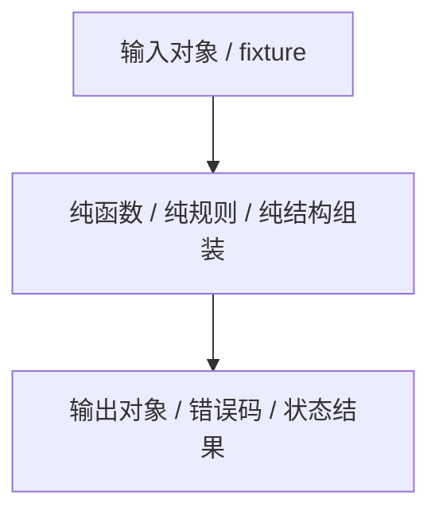

# 单元测试设计

> 文档状态：当前有效
> 角色：单元测试设计
> 适用范围：Factory Agent、Runtime、Trust/Contract 纯逻辑、纯规则和纯结构对象
> 关联文档：
> - `docs/09_测试与验收/测试方案总览.md`
> - `docs/04_系统组件设计/01_工厂Agent编排/工厂Agent状态机.md`
> - `docs/04_系统组件设计/01_工厂Agent编排/编排记忆与恢复设计.md`
> - `docs/04_系统组件设计/03_Runtime执行/Runtime调度与任务系统.md`
> - `docs/04_系统组件设计/03_Runtime执行/数据血缘与可追溯设计.md`

## 1. 设计目标

单元测试只验证纯逻辑边界，不负责验证真实服务协作。  
当前正式目标是 30 个用例，分成三组：

1. Factory Agent 纯逻辑：10 个
2. Runtime 纯逻辑：10 个
3. Trust/Contract 纯逻辑：10 个

## 2. 单元测试边界图

图说明：单元测试只守纯逻辑边界，不触发真实 PG、真实 Worker 或完整主链路。

## 3. Factory Agent 单元测试（10 个）

| ID | 场景 | 核心断言 | 优先级 |
|---|---|---|---|
| `UT-AG-001` | `DISCOVERY` 到 `ALIGN_IO` 的合法跳转判定 | 仅当目标闭合时允许推进 | P0 |
| `UT-AG-002` | `WAIT_USER_INPUT` 与 `WAIT_USER_GATE` 的状态区分逻辑 | 两类等待原因不会混淆 | P0 |
| `UT-AG-003` | `reason_code` 到 `resume_from_stage` 的映射 | 阻塞原因能映射到正确恢复点 | P0 |
| `UT-AG-004` | 蓝图错误聚合器按轮次收集 schema 错误 | 错误去重并保留轮次顺序 | P1 |
| `UT-AG-005` | `blocker_ticket` 结构化组装 | `summary/user_actions/resume_condition` 完整 | P0 |
| `UT-AG-006` | `gate_state` 计算逻辑 | 三类 gate 的 required/confirmed 状态正确 | P0 |
| `UT-AG-007` | `timeline` 事件对象组装 | 时间线事件字段齐全且顺序稳定 | P1 |
| `UT-AG-008` | 交接载荷最小字段校验器 | 缺少 `task_id/workpackage_id/version` 时拒绝提交 | P0 |
| `UT-AG-009` | `runtime_evidence` 摘要组装器 | `result_summary/evidence_refs/trace_id` 正确 | P1 |
| `UT-AG-010` | `publish_decision` 结构对象校验 | 审批人、时间、版本字段不可缺失 | P0 |

## 4. Runtime 单元测试（10 个）

| ID | 场景 | 核心断言 | 优先级 |
|---|---|---|---|
| `UT-RT-001` | Runtime 状态机合法迁移表 | 只允许定义过的状态转换 | P0 |
| `UT-RT-002` | 非法迁移错误对象生成 | 错误码、来源状态、目标状态正确 | P0 |
| `UT-RT-003` | `task_id` 结构校验 | 不接受空值或非法格式 | P1 |
| `UT-RT-004` | `trace_id` 生成与传递规则 | trace 链接键稳定且不丢失 | P0 |
| `UT-RT-005` | `evidence_records` 事件对象标准化 | `actor/action/result/metadata_json` 完整 | P0 |
| `UT-RT-006` | 输入 binding 解析器 | `file/database/http/stream` 模式分支正确 | P0 |
| `UT-RT-007` | 输出 binding 写入策略选择器 | `append/upsert/replace` 规则正确 | P1 |
| `UT-RT-008` | 血缘键组装器 | `publish_id/task_id/raw_id/canonical_id` 组合稳定 | P0 |
| `UT-RT-009` | 结果摘要计算器 | 成功数、失败数、需人工数计算准确 | P1 |
| `UT-RT-010` | 回放事件排序器 | 按时间和阶段输出稳定顺序 | P1 |

## 5. Trust / Contract 单元测试（10 个）

| ID | 场景 | 核心断言 | 优先级 |
|---|---|---|---|
| `UT-TH-001` | `source_id/interface_id` 规范化 | 大小写、分隔符和前缀规则一致 | P1 |
| `UT-TH-002` | `quality_tag` 映射逻辑 | 来源质量标签映射稳定 | P1 |
| `UT-TH-003` | 快照选择器优先返回 `active_release` | 激活版本选择规则正确 | P0 |
| `UT-TH-004` | 能力缺口识别器 | 缺失能力能被准确识别和归类 | P0 |
| `UT-TH-005` | `workpackage_schema` 顶层字段校验器 | 必填顶层对象缺失时返回明确错误 | P0 |
| `UT-TH-006` | `input_bindings/output_bindings` 引用校验器 | 未声明 binding 不可被 steps/scripts 引用 | P0 |
| `UT-TH-007` | `delivery_semantics` 枚举校验 | 非法交付语义会被拒绝 | P1 |
| `UT-TH-008` | `resource.database` 结构校验 | `engine/dsn_env/schema/table` 最小字段完整 | P0 |
| `UT-TH-009` | `resource.file` 结构校验 | `path/path_env` 规则正确 | P1 |
| `UT-TH-010` | 可信数据冲突说明对象组装 | 冲突来源、选择理由和弃用候选摘要完整 | P1 |

## 6. 通过标准

1. 单元测试必须在本地和 CI 稳定执行。
2. 单元测试不依赖真实 PG、真实 Worker、完整服务编排。
3. 所有 P0 单元用例必须作为 PR 基线门禁。
