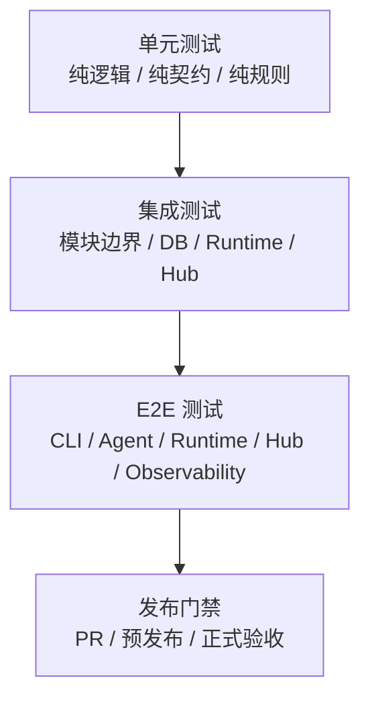
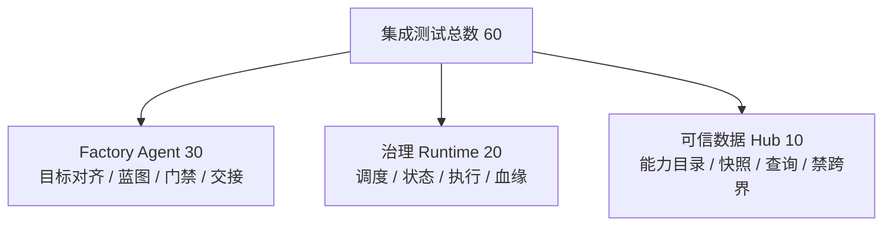

# 测试方案总览

> 文档状态：当前有效
> 角色：系统正式测试方案与门禁总入口
> 适用范围：单元测试、集成测试、E2E 测试、测试环境、测试数据、质量门禁
> 关联文档：
> - `docs/01_产品与业务/产品需求文档.md`
> - `docs/02_总体架构/架构索引.md`
> - `docs/03_数据处理工艺/数据处理总流程.md`
> - `docs/04_系统组件设计/01_工厂Agent编排/工厂Agent编排系统.md`
> - `docs/04_系统组件设计/03_Runtime执行/Runtime调度与任务系统.md`
> - `docs/04_系统组件设计/03_Runtime执行/数据血缘与可追溯设计.md`
> - `docs/04_系统组件设计/03_Runtime执行/数据湖与执行技术架构.md`
> - `docs/05_数据模型设计/数据库分域设计.md`
> - `docs/05_数据模型设计/数据库跨界约束.md`

## 1. 目标

这份文档定义当前系统的正式测试策略，目标有四个：

1. 用统一的测试分层验证工厂 Agent、治理 Runtime、可信数据 Hub 和工作包链路。
2. 让“真实外部 LLM、正式 PG、正式数据库分域、正式血缘对象”进入测试门禁，而不是只停留在架构叙述里。
3. 把测试资产分成可在 PR、集成环境和预发布环境稳定运行的三层。
4. 形成一份可审计的用例目录，确保总用例数不少于 100 个。

## 2. 测试范围

当前正式测试范围包括：

1. Factory Agent 的目标收敛、状态机、记忆、蓝图生成、门禁、Runtime 交接。
2. Runtime 的提交、状态推进、执行器、输入输出 binding、结果回写、证据与血缘。
3. Trust Hub 的能力目录、来源快照、可信数据读取、跨域禁止写入。
4. 工作包 Schema、I/O binding、数据处理工艺、血缘回放和观测接口。
5. 地址治理样板链路的 dryrun、publish、人工复核和回放。

## 3. 非范围

当前不把以下内容纳入正式测试完成标准：

1. 多租户 RBAC 全量能力和复杂租户隔离矩阵。
2. 大规模性能压测与容量上限标定。
3. 历史版本回迁和跨大版本兼容。
4. 未进入正式契约的实验脚本和临时目录。

## 4. 测试分层策略

图说明：这张图只表达测试责任分层，重点看单元、集成、E2E 三层分别守什么边界，以及它们如何共同覆盖正式主链路。

### 4.1 单元测试

单元测试负责验证：

1. 纯逻辑函数
2. 状态转移规则
3. 结构化记忆对象组装
4. binding 解析、血缘键生成、告警阈值计算

### 4.2 集成测试

集成测试负责验证：

1. 模块边界是否真实成立
2. API、Repository、DB、Worker、Executor、Trust Hub 是否按正式契约协作
3. 关键跨模块对象是否能落库、回查、回放

### 4.3 E2E 测试

E2E 测试负责验证：

1. 用户级主流程是否真正跑通
2. 真实 LLM 与正式 PG 是否进入主链路
3. 发布、回放、人工复核和可观测是否闭环
4. 进入自动化实现前必须按 `E2E用例模板.md` 补齐详细规格

## 5. 用例规模与分布

当前正式设计的目标用例数如下：

| 层级 | 用例数 | 说明 |
|---|---:|---|
| 单元测试 | 30 | 覆盖 Agent、Runtime、Trust/Contract 纯逻辑 |
| 集成测试 | 60 | 满足 Factory Agent 30、Runtime 20、Trust Hub 10 |
| E2E 测试 | 15 | 覆盖主链路、失败链路、人工介入、回放与观测 |
| 合计 | 105 | 满足总用例数不少于 100 |

## 6. 集成测试模块配额

图说明：这张图只说明集成测试配额，不表达执行顺序。目的是把测试资源和系统风险对齐到三个核心领域。

## 7. 测试环境矩阵

| 环境 | 用途 | 关键依赖 | 允许的替身策略 |
|---|---|---|---|
| `UT-LOCAL` | 单元测试 | 本地解释器、Schema fixture、纯函数输入 | 允许非 LLM 的纯内存 fixture |
| `INT-CI` | 集成测试 | PostgreSQL、服务容器、`output/` 目录、真实 schema | 不允许绕过 DB；LLM 语义验证不在此层假造成功 |
| `E2E-RING0` | E2E / 预发布验收 | PostgreSQL、Factory Agent、Runtime、Worker、Trust Hub、真实外部 LLM | LLM 验证必须真实调用；不可用则标记 `blocked`，且必须区分责任域 |

## 8. 测试数据设计

### 8.1 数据集编码

为避免各文档重复写长描述，统一使用以下数据集代号：

| 数据集 | 含义 |
|---|---|
| `DS-A` | 标准地址样本，覆盖正常输入 |
| `DS-B` | 歧义地址样本，覆盖多候选与低置信度 |
| `DS-C` | 缺失字段与脏数据样本 |
| `DS-D` | 多来源冲突样本 |
| `DS-E` | 人工复核与门禁回流样本 |
| `DS-F` | 批量输入、发布版本与回放样本 |
| `DS-G` | Trust Hub 来源快照与能力目录样本 |
| `DS-H` | 观测、告警与 trace 回放样本 |

### 8.2 数据原则

1. 所有主链路测试必须能追溯到 `task_id / trace_id / workpackage_id@version`。
2. 所有涉及正式查询的用例必须走 PostgreSQL。
3. 涉及 LLM 能力验证的用例必须真实调用外部 LLM；如果依赖不可用，结果应为 `blocked`，不能伪造通过。

## 9. 质量门禁

### 9.1 PR 门禁

1. 单元测试全量通过。
2. P0 / P1 集成测试通过。
3. 不允许出现数据库跨域写入和 fallback 伪成功。

### 9.2 预发布门禁

1. 全量集成测试通过。
2. E2E 主链路与失败链路通过。
3. 真实 LLM、真实 PG、正式血缘对象至少完成一轮全链路验证。

### 9.3 发布门禁

1. 所有 P0 用例通过。
2. 未通过的 P1 / P2 用例必须有明确豁免说明和责任人。
3. 所有 `blocked` 结果必须留下证据和恢复结论。

## 10. 缺陷分级与处置

| 等级 | 含义 | 处理要求 |
|---|---|---|
| `P0` | 主链路断裂、错误数据写入、不可回放、伪成功 | 阻断发布 |
| `P1` | 关键模块边界失效、状态机错误、门禁失效 | 默认阻断预发布 |
| `P2` | 页面或辅助链路错误、非主路径退化 | 可带责任人进入下一迭代 |

## 11. 文档与测试追踪矩阵

| 设计主题 | 主要测试层 | 主要用例范围 |
|---|---|---|
| Factory Agent 编排系统 | 单元 + 集成 + E2E | `UT-AG-*`、`IT-AG-*`、`E2E-*` |
| Agent 状态机与记忆 | 单元 + 集成 | `UT-AG-*`、`IT-AG-*` |
| Runtime 调度与任务系统 | 单元 + 集成 + E2E | `UT-RT-*`、`IT-RT-*`、`E2E-*` |
| 数据血缘与可追溯 | 单元 + 集成 + E2E | `UT-RT-*`、`IT-RT-*`、`E2E-*` |
| 数据湖与执行技术架构 | 集成 + E2E | `IT-RT-*`、`E2E-*` |
| Trust Hub 与可信数据域 | 单元 + 集成 + E2E | `UT-TH-*`、`IT-TH-*`、`E2E-*` |

## 12. 测试文档阅读顺序

1. [测试方案总览](测试方案总览.md)
2. [单元测试设计](单元测试设计.md)
3. [集成测试设计](集成测试设计.md)
4. [全链路测试设计](全链路测试设计.md)
5. [E2E用例模板](E2E用例模板.md)
6. [测试用例目录](测试用例目录.md)
