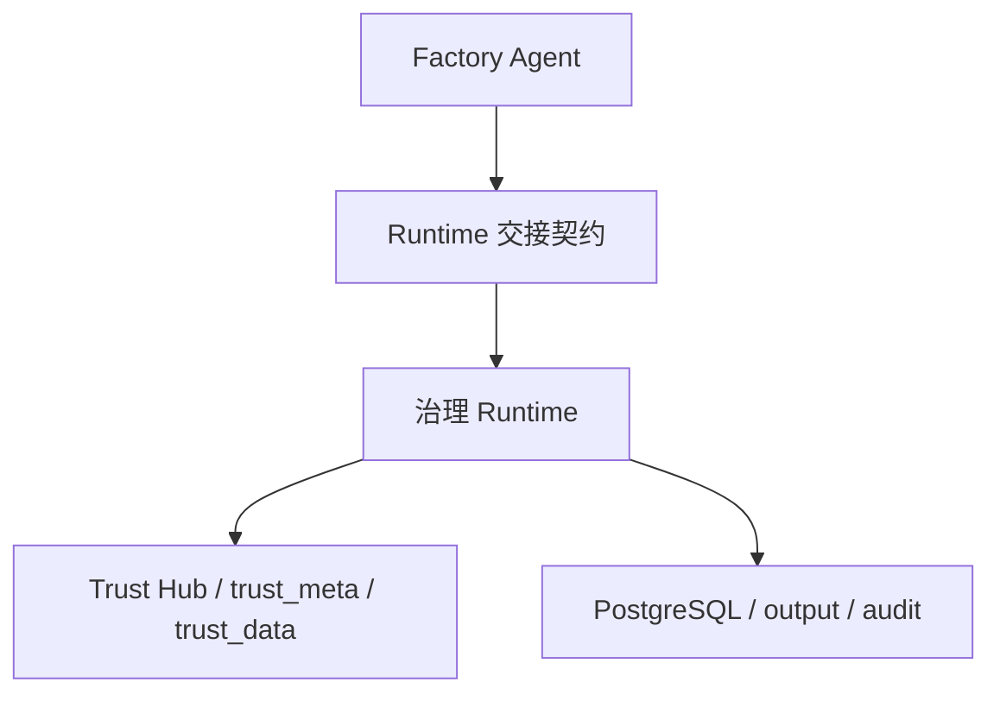

# 集成测试设计

> 文档状态：当前有效
> 角色：模块集成测试设计
> 适用范围：Factory Agent、治理 Runtime、可信数据 Hub 的模块边界与正式协作验证
> 关联文档：
> - `docs/09_测试与验收/测试方案总览.md`
> - `docs/04_系统组件设计/01_工厂Agent编排/工厂Agent编排系统.md`
> - `docs/04_系统组件设计/01_工厂Agent编排/工厂Agent状态机.md`
> - `docs/04_系统组件设计/03_Runtime执行/Runtime调度与任务系统.md`
> - `docs/04_系统组件设计/03_Runtime执行/数据血缘与可追溯设计.md`
> - `docs/05_数据模型设计/数据库跨界约束.md`

## 1. 设计目标

集成测试验证的不是纯函数，而是正式模块边界是否成立。  
当前正式目标是 60 个用例，其中：

1. Factory Agent：30 个
2. 治理 Runtime：20 个
3. 可信数据 Hub：10 个

## 2. 集成测试关注点

图说明：集成测试不是“全部拉起来跑一遍”，而是用模块级正式边界把工厂 Agent、Runtime 和 Trust Hub 的关键协作逐段打通。

## 3. 环境要求

1. PostgreSQL 可用。
2. API、Factory Agent、Runtime、Worker 可以按模块起测。
3. `output/` 目录可写。
4. 涉及真实 LLM 语义验证的 Agent 集成用例必须使用真实 LLM；如果不可用则标记 `blocked`。

## 4. Factory Agent 集成测试（30 个）

| ID | 场景 | 数据集 | 核心断言 | 优先级 |
|---|---|---|---|---|
| `IT-AG-001` | 目标发现阶段写入 `boot_context` 与 `discovery_facts` | `DS-A` | 会话启动后能查询到两类对象 | P0 |
| `IT-AG-002` | 能力盘点阶段写入 `capability_snapshot` | `DS-G` | 来源快照、能力目录、缺口信息完整 | P0 |
| `IT-AG-003` | I/O 对齐成功进入 `BLUEPRINT_LOOP` | `DS-A` | `input_schema/output_schema/bindings` 闭合 | P0 |
| `IT-AG-004` | I/O 未闭合进入 `WAIT_USER_INPUT` | `DS-C` | `reason_code=IO_BINDING_UNRESOLVED` | P0 |
| `IT-AG-005` | 第一轮蓝图 schema 失败被写入 `blueprint_attempts` | `DS-B` | 保存错误明细和失败轮次 | P0 |
| `IT-AG-006` | 第二轮蓝图通过 schema 校验 | `DS-B` | 失败轮次后可继续推进而非重新开会话 | P0 |
| `IT-AG-007` | schema 连续失败达到上限进入 `WAIT_USER_INPUT` | `DS-B` | `retry_count/max_retry` 正确 | P0 |
| `IT-AG-008` | 缺关键 API key 时生成 `blocker_ticket` | `DS-C` | `user_actions`、`resume_from_stage` 正确 | P0 |
| `IT-AG-009` | `confirm_generate` 门禁状态写入 `gate_state` | `DS-A` | 仅确认后才允许继续构建 | P1 |
| `IT-AG-010` | `confirm_dryrun_result` 门禁状态生效 | `DS-E` | 未确认时不能自动进入 publish | P0 |
| `IT-AG-011` | `confirm_publish` 门禁状态生效 | `DS-E` | 发布前必须写 `publish_decision` | P0 |
| `IT-AG-012` | 生成 `opencode_task_ticket` | `DS-A` | ticket 含 bundle 名、任务摘要和输入输出要求 | P1 |
| `IT-AG-013` | 构建成功后写 `build_artifacts_index` | `DS-A` | 产物索引包含入口、脚本和 bundle 路径 | P0 |
| `IT-AG-014` | 构建失败后进入 `WAIT_USER_INPUT` | `DS-C` | 原因码、恢复点与用户动作完整 | P0 |
| `IT-AG-015` | Dryrun 提交时按正式契约组装 Runtime 载荷 | `DS-A` | 最小字段 `task_id/workpackage_id/version/execution_mode` 完整 | P0 |
| `IT-AG-016` | Runtime 回传成功结果后写入 `runtime_evidence` | `DS-A` | `result_summary/evidence_refs/trace_id` 全部写入 | P0 |
| `IT-AG-017` | Runtime 回传 `FAILED` 时转为 `WAIT_USER_INPUT` 或 `BLOCKED` | `DS-C` | 状态映射与原因码正确 | P0 |
| `IT-AG-018` | Runtime 回传 `NEEDS_HUMAN` 时更新人工门禁状态 | `DS-E` | `gate_state` 与 `interaction_state` 一致 | P1 |
| `IT-AG-019` | 时间线 `timeline` 在各阶段持续追加 | `DS-A` | 至少覆盖发现、蓝图、构建、验证、发布五类事件 | P1 |
| `IT-AG-020` | 发布决策写入 `publish_decision` | `DS-A` | 包含确认人、时间、版本信息 | P0 |
| `IT-AG-021` | `WAIT_USER_INPUT` 恢复到 `ALIGN_IO` | `DS-C` | 用户补 binding 后从恢复点继续 | P0 |
| `IT-AG-022` | `WAIT_USER_INPUT` 恢复到 `BLUEPRINT_LOOP` | `DS-B` | 用户缩小范围后不丢失前序事实记忆 | P1 |
| `IT-AG-023` | `WAIT_USER_GATE` 仅表示等待签字，不表示缺信息 | `DS-E` | `WAIT_USER_GATE` 与 `WAIT_USER_INPUT` 区分成立 | P0 |
| `IT-AG-024` | 实时外部 LLM 成功返回结构化蓝图 | `DS-A` | 蓝图字段完整并通过 schema 校验 | P0 |
| `IT-AG-025` | 外部 LLM 返回非结构化结果时进入修正循环 | `DS-B` | 不伪通过，错误进入 `blueprint_attempts` | P0 |
| `IT-AG-026` | 外部 LLM 不可用时结果标记 `blocked` | `DS-C` | 不使用本地 fake response | P0 |
| `IT-AG-027` | `capability_gap` 阻塞场景 | `DS-G` | 缺失能力明确写入 `missing_capabilities` | P1 |
| `IT-AG-028` | 重复版本发布请求冲突处理 | `DS-F` | 同一 `workpackage_id@version` 不产生歧义记录 | P1 |
| `IT-AG-029` | 交接契约里 `input_binding_ref` 解析正确 | `DS-F` | Runtime 可据此找到正式输入源 | P0 |
| `IT-AG-030` | 发布阻塞场景写入审计与门禁对象 | `DS-E` | `publish_decision`、`blocker_ticket`、审计记录一致 | P0 |

## 5. 治理 Runtime 集成测试（20 个）

| ID | 场景 | 数据集 | 核心断言 | 优先级 |
|---|---|---|---|---|
| `IT-RT-001` | `submit()` 创建 `SUBMITTED` 状态 | `DS-A` | `control_plane.task_state` 与证据记录同时生成 | P0 |
| `IT-RT-002` | 非法状态迁移被拒绝 | `DS-C` | 不写入非法状态，审计里有失败原因 | P0 |
| `IT-RT-003` | `APPROVAL_PENDING -> APPROVED` 合法迁移 | `DS-E` | 审批动作与状态变化一致 | P0 |
| `IT-RT-004` | `APPROVED -> CHANGESET_READY -> EXECUTING` 合法推进 | `DS-A` | 状态序列完整且可回查 | P0 |
| `IT-RT-005` | `EXECUTING -> EVALUATING -> COMPLETED` 成功闭环 | `DS-A` | 结果、证据、最终状态一致 | P0 |
| `IT-RT-006` | 执行失败进入 `FAILED` | `DS-C` | `failure_reason`、证据和状态一致 | P0 |
| `IT-RT-007` | 评估阶段进入 `NEEDS_HUMAN` | `DS-E` | 需人工复核的原因和证据完整 | P1 |
| `IT-RT-008` | `NEEDS_HUMAN` 经批准后恢复执行 | `DS-E` | 状态恢复点清晰，历史轨迹保留 | P1 |
| `IT-RT-009` | 执行中回滚进入 `ROLLED_BACK` | `DS-C` | 回滚动作和原因被审计 | P1 |
| `IT-RT-010` | 发布记录与任务实例关联成立 | `DS-F` | 能从 `publish_record` 回查 `task_id` | P0 |
| `IT-RT-011` | 提交时写入 `evidence_records` 初始化事件 | `DS-A` | `actor/action/result` 字段完整 | P0 |
| `IT-RT-012` | 结束时写入最终证据事件 | `DS-A` | 最终状态、结果摘要、artifact_ref 可查询 | P0 |
| `IT-RT-013` | file binding 输入装载成功 | `DS-F` | 输入 reader 使用正式 binding 而非硬编码路径 | P0 |
| `IT-RT-014` | database binding 输入装载成功 | `DS-F` | 从正式 schema 读取并带分页/批次上下文 | P0 |
| `IT-RT-015` | 文件输出 binding 写入证据产物层 | `DS-F` | `output/` 文件与 DB 引用一致 | P0 |
| `IT-RT-016` | 数据库输出 binding 写入正式业务表 | `DS-A` | 不跨域写入，不写临时表 | P0 |
| `IT-RT-017` | Worker 只按 `workpackage_id@version` 执行 bundle | `DS-A` | 不直接 import 主线算法模块 | P0 |
| `IT-RT-018` | 血缘对象 `task_id/trace_id/publish_id` 全量落地 | `DS-F` | 结果、证据、发布记录可交叉回查 | P0 |
| `IT-RT-019` | Trace 回放按 `trace_id` 返回完整事件序列 | `DS-H` | 时间线可重建，顺序正确 | P1 |
| `IT-RT-020` | 结果与审计分层落地 | `DS-A` | `governance`、`control_plane`、`audit` 不混写 | P0 |

## 6. 可信数据 Hub 集成测试（10 个）

| ID | 场景 | 数据集 | 核心断言 | 优先级 |
|---|---|---|---|---|
| `IT-TH-001` | `capability_registry` 注册与查询闭环 | `DS-G` | 能力定义写入 `trust_meta` 并可被 Agent 读取 | P0 |
| `IT-TH-002` | `source_snapshot` 创建与激活 | `DS-G` | 激活版本可唯一定位到来源快照 | P0 |
| `IT-TH-003` | `active_release` 切换后查询口径稳定 | `DS-G` | 最新发布可被治理链正确消费 | P1 |
| `IT-TH-004` | `trust_data.admin_division` 查询链路 | `DS-G` | 正式查询入口走 `trust_data.*` | P0 |
| `IT-TH-005` | `trust_data.road_index` 查询链路 | `DS-G` | 结果可被地址核验阶段消费 | P0 |
| `IT-TH-006` | `trust_data.sample_data` 读取与样例增强 | `DS-G` | 样例数据可用于能力展示与回放 | P1 |
| `IT-TH-007` | 治理链路禁止直接改写 `trust_meta.*` | `DS-G` | 越界写入被拒绝并记录原因 | P0 |
| `IT-TH-008` | 治理链路禁止把 `trust_data.*` 当结果回写表 | `DS-G` | DB 跨界约束生效 | P0 |
| `IT-TH-009` | 兼容视图与正式物理表口径一致 | `DS-G` | 读取字段集和主键语义一致 | P1 |
| `IT-TH-010` | Trust 查询行为进入观测与审计 | `DS-H` | 查询摘要、trace 和审计事件完整 | P1 |

## 7. 通过标准

1. 60 个集成用例全部有明确数据集和断言。
2. 所有 P0 用例必须通过。
3. 任何真实依赖不可用场景必须返回 `blocked` 或失败，不得伪成功。
