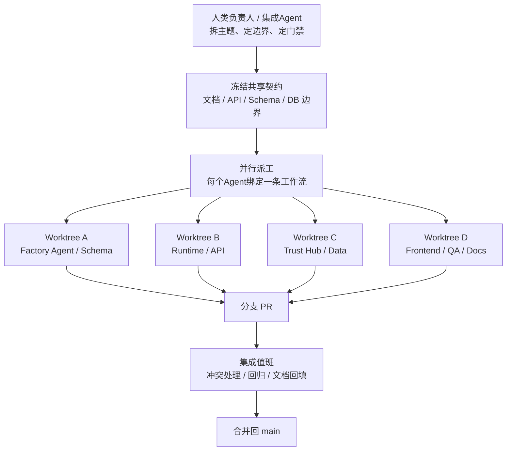
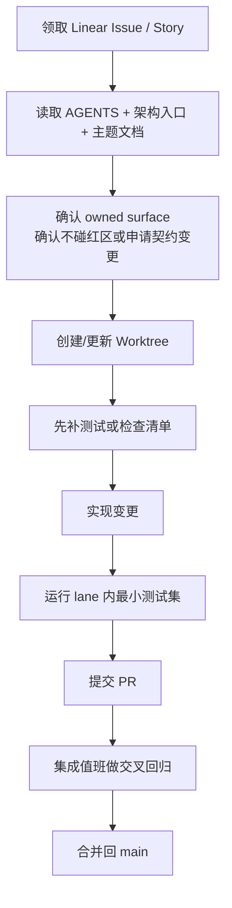

# 多Agent与多Worktree并行开发规范

> 文档状态：当前有效
> 角色：后续大规模重构与并行开发的正式协作规范
> 关联文档：
> - `AGENTS.md`
> - `docs/10_研发与工程规范/代码规范.md`
> - `docs/10_研发与工程规范/版本管理策略.md`
> - `docs/10_研发与工程规范/项目目录结构.md`
> - `docs/99_研发过程管理/文档分层索引.yaml`

## 1. 目标

本规范用于回答三件事：

1. 后续大规模重构时，如何让多个 Agent 并行推进而不互相踩踏。
2. 如何用多个 Git Worktree 隔离代码、测试和运行环境。
3. 如何保证并行开发仍然服从正式文档、模块边界、数据库边界和测试门禁。

当前默认基线如下：

1. 集成主干：`main`
2. 已冻结保留分支：`codex/pre-refactor-main-20260307`
3. 已冻结基线标签：`pre-refactor-20260307`

## 2. 适用范围

本规范适用于以下场景：

1. 同一阶段有两个及以上 Agent 同时开发。
2. 同一阶段有两个及以上主题并行推进。
3. 需要隔离依赖、端口、数据库或运行产物，避免本地工作区互相污染。

不适用于以下场景：

1. 单人单线程的小修小补。
2. 只做文案润色且不涉及主链路契约的改动。

## 3. 总体协作模型

图说明：先由人类或集成 Agent 做拆解与派工，再由多个实现 Agent 在各自 Worktree 内开发，最后回到 `main` 做集成与回归。



## 4. 并行开发基本规则

### 4.1 一条工作流对应一个 Agent、一个 Worktree、一个分支

每条并行工作流必须同时满足：

1. 只绑定一个明确的研发主题或 Story。
2. 只绑定一个 Agent 负责人。
3. 只绑定一个 Worktree。
4. 只绑定一个分支。

禁止：

1. 一个 Agent 同时在两个 Worktree 上交替修改。
2. 两个 Agent 共同写同一个 Worktree。
3. 一个分支承接多个无关主题。

### 4.2 分支命名

分支统一使用 `codex/` 前缀，推荐格式：

1. `codex/<lane>-<topic>`
2. `codex/<area>-<story-id>`

示例：

1. `codex/factory-agent-orchestration`
2. `codex/runtime-lineage-hardening`
3. `codex/trust-hub-contracts`
4. `codex/frontend-workbench`
5. `codex/qa-e2e-gates`

### 4.3 Worktree 目录放在主仓外部

推荐放到主仓同级目录，例如：

```text
../spatial-intelligence-data-factory-worktrees/
├── 01-factory-agent/
├── 02-runtime/
├── 03-trust-hub/
├── 04-frontend/
└── 05-qa/
```

禁止把 Worktree 嵌套到主仓内部，避免：

1. 文件搜索污染
2. 编辑器索引混乱
3. `git status` 和脚本误扫

### 4.4 每个 Worktree 自带独立本地状态

每个 Worktree 默认独立维护：

1. `.venv/`
2. `.env.local`
3. `output/<lane>/` 或本地临时产物目录
4. 测试数据库名、Schema 名或队列前缀

允许共享的只有：

1. Git 历史
2. 远端仓库
3. 正式文档与正式契约
4. 受控的公共基础设施容器

## 5. 推荐并行 Lane 切分

### 5.1 推荐的 6 条主 Lane

| Lane | 主责任 | 推荐负责人 | 主要目录 |
|---|---|---|---|
| `lane-01` | 工厂 Agent 编排与状态机 | Agent 实现 Agent | `packages/factory_agent/`、`docs/04_系统组件设计/01_工厂Agent编排/` |
| `lane-02` | Runtime 执行、任务状态、血缘 | Runtime Agent | `services/governance_worker/`、`services/governance_api/`、`docs/04_系统组件设计/03_Runtime执行/` |
| `lane-03` | Workpackage Schema、样例、生成契约 | Schema Agent | `workpackage_schema/`、`docs/04_系统组件设计/02_工作包协议/` |
| `lane-04` | Trust Hub、数据契约、可信查询 | 数据 Agent | `services/trust_data_hub/`、`docs/04_系统组件设计/04_数据与人工介入/`、`docs/05_数据模型设计/` |
| `lane-05` | 前端工作台、回放、管理台 | Frontend Agent | `web/`、`docs/06_前端与交互设计/` |
| `lane-06` | 集成测试、E2E、回归门禁 | QA Agent | `tests/`、`docs/09_测试与验收/` |

### 5.2 集成值班角色

除以上实现 Lane 外，建议保留一个“集成值班”角色，不长期开发业务，而是负责：

1. 冻结共享契约
2. 处理跨 Lane 冲突
3. 控制合并顺序
4. 维护 `main` 可回归
5. 回填正式文档入口

## 6. 共享契约冻结规则

### 6.1 并行开发前先冻结的共享对象

以下对象在并行开发前必须先冻结或先指定唯一 owner：

1. `AGENTS.md`
2. `docs/00_阅读指南.md`
3. `docs/02_总体架构/架构索引.md`
4. `docs/99_研发过程管理/文档分层索引.yaml`
5. `workpackage_schema/schemas/v1/*.json`
6. 数据库域边界与跨界约束文档
7. Agent 与 Runtime 交接契约
8. 可信数据 API / DB 契约

### 6.2 红区文件

以下文件或目录默认属于红区，不能由多个 Lane 并发自由修改：

1. `AGENTS.md`
2. `docs/00_阅读指南.md`
3. `docs/02_总体架构/`
4. `docs/10_研发与工程规范/`
5. `docs/99_研发过程管理/文档分层索引.yaml`
6. `workpackage_schema/schemas/`
7. `migrations/versions/`
8. `services/governance_api/app/models/`

处理方式只能是二选一：

1. 指定唯一 owner 串行修改
2. 先提契约 PR，再由各 Lane 基于契约实现

## 7. 日常工作流

图说明：每个 Lane 的日常动作应该是固定节奏，不允许一边写代码一边临时改边界。



### 7.1 建立 Worktree

推荐命令：

```bash
mkdir -p ../spatial-intelligence-data-factory-worktrees
git worktree add \
  ../spatial-intelligence-data-factory-worktrees/02-runtime \
  -b codex/runtime-lineage-hardening \
  main
```

### 7.2 回收 Worktree

```bash
git worktree remove ../spatial-intelligence-data-factory-worktrees/02-runtime
git branch -d codex/runtime-lineage-hardening
```

## 8. 集成与回归门禁

### 8.1 每条 Lane 的最小门禁

1. 有对应的 Linear Issue / Story。
2. 有明确 owned surface。
3. 已说明是否影响 Ring1 正式文档。
4. 已补测试、验收检查单或最小复现脚本。
5. 不提交本地临时产物，例如：
   - `output/`
   - `docs/.obsidian/workspace.json`
   - 本地缓存和临时数据库

### 8.2 合并回 main 前的门禁

1. 先同步 `main` 最新基线。
2. 跑本 Lane 最小测试集。
3. 若影响共享契约，先确认对应正式文档已回填。
4. 若影响跨域接口，需通知下游 Lane 做联调回归。
5. PR 必须写清：
   - owned surface
   - 影响的契约
   - 需要谁回归

### 8.3 每日集成节奏

建议采用固定节奏：

1. 上午冻结契约改动窗口。
2. 白天各 Lane 实现。
3. 下午或晚间做一次集成回归。
4. 未过回归的分支不得硬合并。

## 9. AI Coding 的默认生效方式

只要启用多 Agent / 多 Worktree 并行开发，后续 AI Coding 默认服从以下规则：

1. 先读 `AGENTS.md`
2. 再读 `docs/99_研发过程管理/文档分层索引.yaml`
3. 再读本规范
4. 最后读当前 Story / 主题文档

也就是说，AI Agent 不是先“找代码改”，而是先判断：

1. 自己属于哪条 Lane
2. 当前 Worktree 的 owned surface 是什么
3. 哪些文件是红区
4. 哪些正式文档必须同步回填

## 10. 本轮大规模重构的建议推进顺序

建议分四个阶段：

### 10.1 阶段 A：冻结基线

1. 以 `pre-refactor-20260307` 和 `codex/pre-refactor-main-20260307` 作为回退基线
2. 明确 6 条 Lane
3. 明确红区 owner

### 10.2 阶段 B：先契约后实现

1. 先收口 Agent / Runtime / Schema / Trust Hub 契约
2. 契约合并后，各 Lane 再并行实现

### 10.3 阶段 C：并行实现

1. Factory Agent
2. Runtime
3. Trust Hub
4. Frontend
5. QA / E2E

### 10.4 阶段 D：集成与清场

1. 合并顺序优先：契约 -> 下游实现 -> 页面 -> E2E
2. 每合并一条 Lane，更新一次正式文档和回归结论

## 11. 不这样做会出现什么问题

1. 多个 Agent 同改共享文件，冲突会集中爆发在最后。
2. 没有红区和契约 owner，`main` 会被不断重写边界。
3. 共用一个工作区时，本地依赖、端口和测试状态会互相污染。
4. 没有集成值班时，PR 虽然都能过单测，但主链无法稳定回归。
