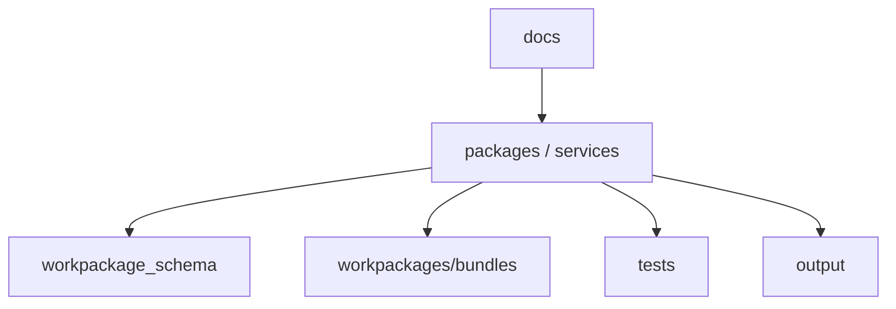

# 项目目录结构

> 角色：目录导航
> 来源：`SOURCE_CODE_DIRECTORY_REFERENCE.md`

## 1. 重点目录

| 目录 | 作用 |
|---|---|
| `docs/` | 正式文档与研发过程管理文档 |
| `packages/` | 可复用 Python 包 |
| `services/` | API / Worker 等服务实现 |
| `workpackage_schema/` | 工作包协议与示例 |
| `workpackages/bundles/` | 可执行工作包 |
| `tests/` | 自动化测试 |
| `output/` | 运行产物、证据、看板数据 |

如果启用多 Worktree 并行开发，推荐在主仓外同级目录建立：

1. `../spatial-intelligence-data-factory-worktrees/`

该目录不属于主仓受控目录，不应写入正式文档、正式代码或共享产物。

## 2. 目录关系图

图说明：正式文档、代码、协议、工作包、测试和运行产物目录之间的关系。

## 3. 使用建议

1. 新增正式文档优先进入 `docs/` 编号目录或 `docs/99_研发过程管理/`。
   正式阅读目录当前采用自然阅读顺序：`01_产品与业务 -> 02_总体架构 -> 03_数据处理工艺 -> 04_系统组件设计 -> 05_数据模型设计 -> 06_前端与交互设计 -> 07_系统运行与运维 -> 08_AI能力设计 -> 09_测试与验收 -> 10_研发与工程规范 -> 11_附录`。
2. 项目级流程文件和研发主题文件统一进入 `docs/99_研发过程管理/`；`2026-03-05` 及之前的历史过程文档统一进入 `docs/99_研发过程管理/99_归档/截止2026-03-05/`。
3. 后续 AI Coding 在决定文档落点前，先读取 `AGENTS.md` 与 `docs/99_研发过程管理/文档分层索引.yaml`；由该索引裁决写入正式目录、过程目录还是归档目录。
4. 新增治理算法优先进入 `workpackages/bundles/`。
5. 运行产物不应混入正式文档目录。
6. 多 Worktree 模式下，Worktree 根目录放在主仓外部，不纳入本仓正式目录结构。
