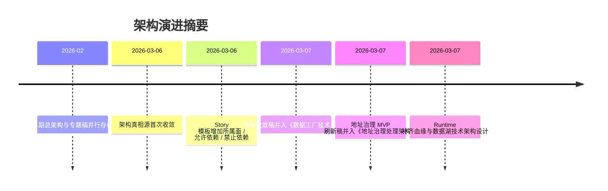

# 架构演进记录

> 角色：当前演进摘要
> 来源：`docs/02_总体架构/数据工厂技术架构.md`、`docs/11_附录/架构引用迁移说明.md`

## 1. 演进时间线

图说明：这张图只保留当前正式文档体系里仍然重要的演进节点，帮助读者理解为什么会有“正式章节 + 历史归档 + 研发过程管理”三类文档。

## 2. 当前收敛结论

1. 当前主仓按控制面、执行面、资产面、证据面四个面理解。
2. 总体技术基线统一归口到《数据工厂技术架构》。
3. 地址治理样板处理链统一归口到《地址治理处理架构》。
4. Runtime 正式设计补齐了调度、交接、数据处理、血缘和数据湖技术栈五个子主题。
5. 历史增量稿只保留在归档区，不再作为新开发默认依据。
